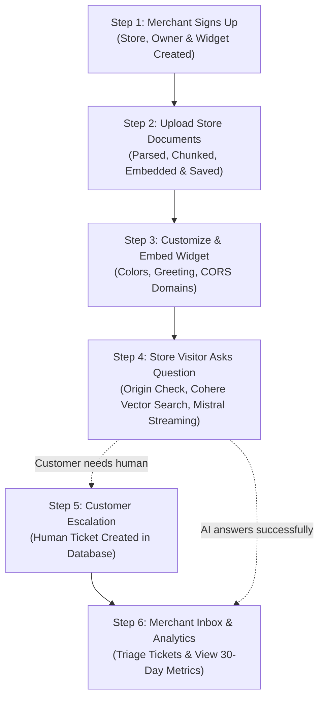

# ResolvDesk Backend - Complete End-to-End System Flow

This document explains exactly how ResolvDesk works behind the scenes from the moment a user signs up to the moment an AI assistant answers a customer on a storefront.

---

## 🗺️ High-Level Lifecycle Map



---

## Step 1: Merchant Signup & Account Provisioning

### What happens:
1. The store owner fills out the signup form with their **Name**, **Email**, **Password**, and **Store Website URL** (e.g. `https://shoeking.com`).
2. The frontend completes Better Auth credentials creation and sends the provisioning payload to the backend:
   * **Endpoint:** `POST /api/v1/registration/complete`
   * **Router:** `app/routers/registration.py`

### Inside the Backend:
1. The **Router** validates the input using Pydantic (`RegistrationCompleteRequest`) and passes it to:
   * **Service:** `app/services/registration_service.py` (`RegistrationService.complete_registration`)
2. The **Service** executes the cross-domain onboarding workflow:
   * **Pre-validation checks:** Calls `OwnerRepo.get_by_id` and `OwnerRepo.get_by_email` to prevent duplicates.
   * Extracts and normalizes the website domain (e.g. `https://shoeking.com/shop` → `shoeking.com`).
   * Opens an **atomic multi-table transaction** (either everything succeeds or nothing is saved):
     * Calls `OrganizationRepo.create_organization` to create the store record in `organizations`.
     * Calls `OwnerRepo.create` to create the merchant owner profile in `owners` linked to the organization.
     * Calls `WidgetRepo.create_widget_config` to generate:
       * A unique public widget key (e.g. `rd_live_a1b2c3d4...`).
       * Default branding colors, bot name, and welcome greeting.
       * **Restricted CORS Allowed Domains:** auto-set to `shoeking.com, localhost`.
     * **Commits the transaction to Neon PostgreSQL**.

### 💾 What is now saved in the Database:
* **`organizations` table:** 1 row with store name and website URL.
* **`owners` table:** 1 row with merchant email, name, status, and `organization_id`.
* **`widget_configurations` table:** 1 row with unique `widget_key`, default greeting, and `allowed_origins = "shoeking.com, localhost"`.

---

## Step 2: Knowledge Ingestion (Merchant Uploads Documents)

### What happens:
1. The merchant logs into their ResolvDesk dashboard, goes to **Knowledge Base**, and uploads a file (such as a Return Policy PDF, Shipping FAQ Markdown file, or Product Catalog DOCX).
2. The frontend sends a multi-part file upload:
   * **Endpoint:** `POST /api/v1/documents/upload`
   * **Router:** `app/routers/documents.py`

### Inside the Backend:
1. **Router (`documents.py`):**
   * Verifies the merchant's JWT session via `get_current_owner` to extract their `organization_id`.
   * Passes the uploaded file bytes to:
   * **Service:** `app/services/ingestion_service.py` (`IngestionService.ingest_file`)
2. **Text Extraction:**
   * `ingestion_service.py` detects the file type and calls the appropriate parser from `app/services/parsers/` (PDF parser, DOCX parser, or Markdown/TXT reader).
   * Extracts clean, readable text.
3. **Chunking (`app/services/chunker_service.py`):**
   * Splits long documents into bite-sized semantic chunks (500 tokens with a 50-token overlap so sentences aren't cut in half).
4. **Embeddings (`app/services/embedding_service.py`):**
   * Sends the text chunks to **Cohere v3** (`embed-english-v3.0`).
   * Cohere converts each text chunk into a **1024-dimensional vector** (a list of 1024 numbers representing the exact meaning of that paragraph).
5. **Dual Storage Persistence:**
   * **Qdrant Cloud (Vector DB):** Saves the 1024-dim vectors tagged with `{organization_id, document_id, text}`.
   * **Neon PostgreSQL:** Calls `DocumentRepo` to save the document title, file size, status (`indexed`), and each chunk's reference.

### 💾 What is now saved in the Databases:
* **PostgreSQL (`documents`):** File metadata row (e.g. `return-policy.pdf`, size: 120KB, chunks: 8, status: `indexed`).
* **PostgreSQL (`document_chunks`):** 8 rows containing the chunk text and point IDs.
* **Qdrant Cloud (`resolvdesk_documents`):** 8 vector points with 1024 numbers each, locked to this merchant's `organization_id`.

---

## Step 3: Widget Customization & Embed Snippet

### What happens:
1. The merchant goes to **Widget Customizer** in the dashboard.
2. They customize:
   * Bot display name (e.g. "Shoe King Assistant").
   * Welcome greeting (e.g. "Hi! How can I help with your order today?").
   * Brand theme color (e.g. emerald green `#059669`).
   * Placement (bottom-right).
   * Allowed Domains (e.g. `shoeking.com, localhost`).
3. Clicks **Save Changes**:
   * **Endpoint:** `PATCH /api/v1/organization/widget`
   * **Router:** `app/routers/organizations.py`
   * **Service & Repo:** Updates `widget_configurations` table in PostgreSQL.
4. The merchant copies their embed script snippet:
   ```html
   <script src="https://resolvdesk.com/widget.js" data-widget-key="rd_live_abc123..." defer></script>
   ```
5. Pastes it into their store HTML (Shopify, WordPress, Webflow, or custom React/Next.js site).

---

## Step 4: Store Visitor Asks a Question (Live AI Chat)

### What happens:
1. A real shopper visits `https://shoeking.com`.
2. The lightweight `widget.js` runs in the shopper's browser and mounts a chat bubble.
3. The shopper types: *"What is your return policy?"* and presses Enter.
4. The widget sends an HTTP POST request to the ResolvDesk backend:
   * **Endpoint:** `POST /api/v1/widget/chat`
   * **Router:** `app/routers/widget.py`
   * **Headers:** `X-Widget-Key: rd_live_abc123...`, `Origin: https://shoeking.com`
   * **Body:** `{"message": "What is your return policy?", "conversation_id": null}`

### Inside the Backend:
1. **Router (`widget.py`):**
   * Validates the payload and calls:
   * **Service:** `app/services/chat_service.py` (`ChatService.stream_visitor_message`)
2. **Security, Tenant & Origin Verification (`is_origin_allowed`):**
   * Calls `WidgetRepo.get_by_public_key` to resolve active primary or grace key.
   * Checks the incoming browser `Origin` header against `widget.allowed_origins`:
     * ❌ **No match:** Returns `403 Forbidden` (`"Domain not authorized for this widget"`). An unauthorized website cannot hijack your assistant!
     * ✅ **Match:** Proceeds to validation.
   * Calls `OwnerRepo.get_by_organization_id` to verify the merchant owner status is active (blocks suspended accounts).
   * Calls `OrganizationRepo.get_organization_by_id` to verify organization tenant existence.
3. **Rate Limiting Check (`app/core/rate_limiter.py`):**
   * Protects against spam by enforcing a 30 messages/minute sliding window per IP.
4. **Vector Semantic Search (RAG):**
   * Calls `EmbeddingService.get_embedding("What is your return policy?")` using Cohere to get a 1024-dim vector for the question.
   * Calls `VectorRepo.search_similar_chunks` in **Qdrant Cloud** with a strict tenant filter:
     `WHERE organization_id == merchant_id`
   * Qdrant returns the most relevant paragraphs from the merchant's uploaded documents with similarity scores.
5. **Confidence Evaluation:**
   * Is the best match score above the threshold (`0.28`)?
     * **If Yes:** Constructs an accurate system prompt containing the retrieved store document chunks + the last 10 turns of conversation history.
     * **If No:** Streams the graceful fallback message: *"I don't have information about that in my knowledge base. Would you like me to connect you with a human who can help?"* and offers an escalation button.
6. **Streaming Response (Mistral AI):**
   * Calls `LLMService.stream_completion` connected to **Mistral AI (`open-mistral-7b`)**.
   * As Mistral generates each word, `chat_service.py` streams it directly to the browser widget using Server-Sent Events (SSE):
     ```text
     event: start
     data: {"conversation_id": "9b1deb4d..."}

     event: token
     data: {"token": "We "}

     event: token
     data: {"token": "offer a 30-day "}

     event: token
     data: {"token": "money-back return policy."}

     event: citation
     data: {"citations": [{"title": "return-policy.pdf", "chunk_id": "..."}]}

     event: done
     ```
7. **Conversation History Saved:**
   * Calls `ConversationRepository` in `app/repos/conversation_repo.py`.
   * Creates or updates the `conversations` record.
   * Saves both the visitor's question and the assistant's answer with citations into the `messages` table in Neon PostgreSQL.

---

## Step 5: Customer Escalation (Human Ticket Creation)

### What happens:
1. If the shopper needs human help or their question wasn't answered, they click:
   **"🙋 Speak with a Human Support Agent"** inside the chat widget.
2. A form opens in the widget asking for their **Email** and a brief description of the issue.
3. The widget sends:
   * **Endpoint:** `POST /api/v1/widget/chat/escalate`
   * **Router:** `app/routers/widget.py`

### Inside the Backend:
1. The router forwards to `chat_service.py`.
2. Calls `ConversationRepository.escalate_conversation`:
   * Marks `is_escalated = True`.
   * Sets `ticket_status = "open"`.
   * Saves the customer's email (e.g. `shopper@gmail.com`) and optional reason.
3. Commits to Neon PostgreSQL.
4. Returns ticket confirmation back to the widget: `{"success": true, "ticket_id": "...", "visitor_email": "shopper@gmail.com"}`.

### 💾 What is now in the Database:
* The conversation record in `conversations` now has:
  * `is_escalated = True`
  * `ticket_status = "open"`
  * `visitor_email = "shopper@gmail.com"`
  * Complete message transcript leading up to the escalation.

---

## Step 6: Merchant Support Inbox & Analytics Dashboard

### What happens:
1. The merchant opens their dashboard and clicks **Conversations**:
   * Frontend calls `GET /api/v1/conversations?status=open`.
   * **Router:** `app/routers/conversations.py`
   * **Service:** `app/services/owner_conversation_service.py`
   * **Repo:** `app/repos/conversation_repo.py` queries Neon PostgreSQL:
     ```sql
     SELECT * FROM conversations 
     WHERE organization_id = :my_org_id AND is_escalated = TRUE AND ticket_status = 'open'
     ORDER BY updated_at DESC;
     ```
2. The merchant clicks on the conversation to inspect:
   * Reads the customer's email.
   * Reads the exact questions the customer asked and the AI's answers.
   * Changes status from **"open"** → **"in_progress"** → **"resolved"** via `PATCH /api/v1/conversations/{id}`.
3. The merchant opens the **Overview** dashboard:
   * Frontend calls `GET /api/v1/analytics/overview`.
   * **Router:** `app/routers/analytics.py`
   * **Service:** `app/services/analytics_service.py`
   * **Repo:** `app/repos/analytics_repo.py` calculates 30-day metrics:
     * Total conversations count.
     * AI resolution rate (e.g. 85%).
     * Escalation rate (e.g. 15%).
     * Most cited documents.
     * Daily chat volume chart data.

---

## 🏗️ Clean 3-Tier Layer Summary

Notice how every single feature follows the exact same 3 steps:

| Step | Layer | Folder | What it does |
| :--- | :--- | :--- | :--- |
| **1** | **Router** | `app/routers/` | Accepts HTTP request from frontend or widget, checks authentication and types. Never writes SQL or business logic. |
| **2** | **Service** | `app/services/` | Runs the business workflow (domain extraction, chunking, Cohere embeddings, Mistral AI generation, transactions). |
| **3** | **Repository** | `app/repos/` | Executes queries on Neon PostgreSQL and Qdrant Cloud. Enforces tenant isolation (`WHERE organization_id = ...`). |

---

## 🏛️ Domain Entity Layer Decoupling

Every domain entity in ResolvDesk has a dedicated, isolated repository and service without mixing cross-domain concerns:

| Domain Entity | Database Model (`app/models/`) | Repository (`app/repos/`) | Service (`app/services/`) | Primary Router (`app/routers/`) |
| :--- | :--- | :--- | :--- | :--- |
| **Owner** | `Owner` (`owners` table) | `OwnerRepo` | `OwnerService` | `organizations.py` (`GET /me`) & `auth.py` |
| **Organization** | `Organization` (`organizations` table) | `OrganizationRepo` | `OrganizationService` | `organizations.py` (`GET /organization/profile`) |
| **Widget** | `WidgetConfiguration` (`widget_configurations`) | `WidgetRepo` | `WidgetService` | `widget.py` & `organizations.py` |
| **Knowledge Base** | `Document` (`documents` table) | `DocumentRepository` & `VectorRepository` | `DocumentService` & `IngestionService` | `documents.py` |
| **Conversations & Messages** | `Conversation`, `Message` | `ConversationRepository` | `OwnerConversationService` & `ChatService` | `conversations.py` & `widget.py` |
| **Analytics** | Aggregated across tables | `AnalyticsRepo` | `AnalyticsService` | `analytics.py` |
| **Multi-Entity Onboarding** | Coordinates `Owner` + `Org` + `Widget` | Coordinates `OwnerRepo` + `OrganizationRepo` + `WidgetRepo` | `RegistrationService` | `registration.py` |
