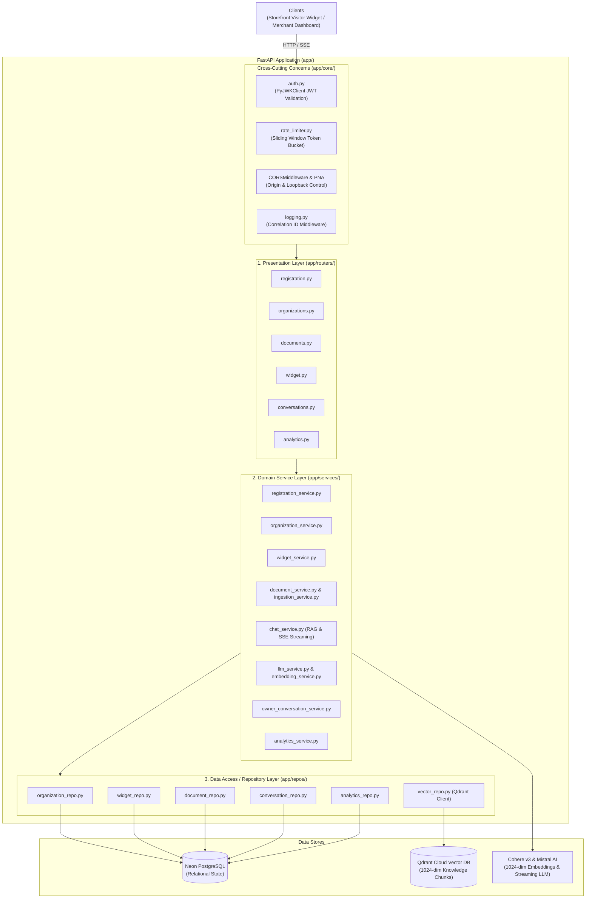
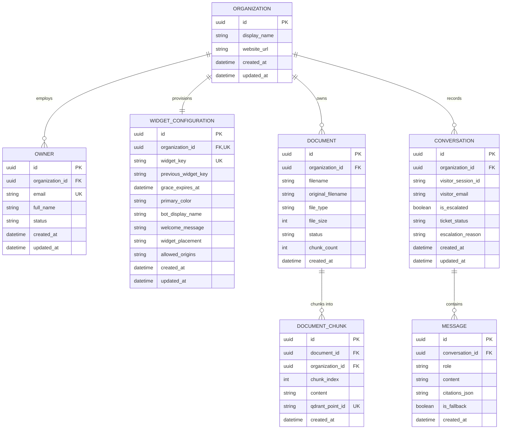
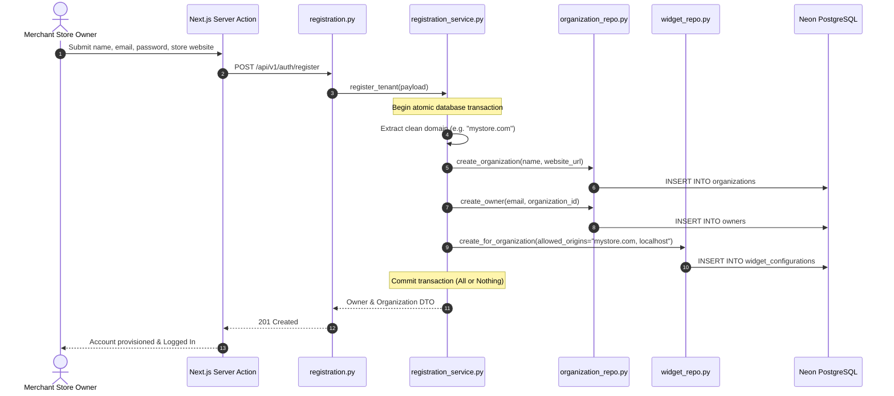
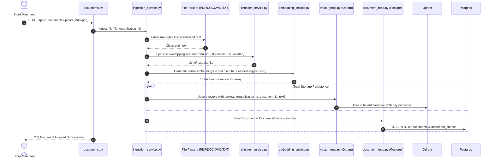
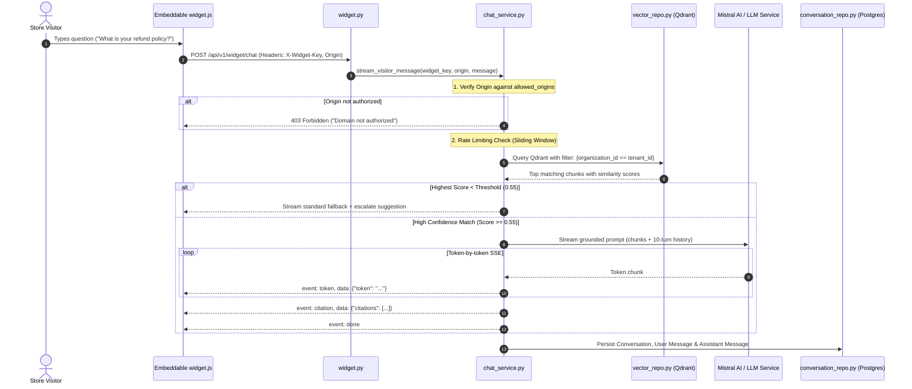
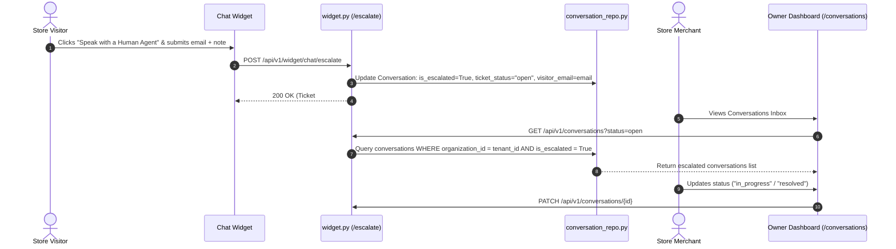

# ResolvDesk Backend Architecture

Comprehensive architectural overview, subsystem workflows, data models, and design patterns powering the ResolvDesk backend resource server.

---

## 1. Architectural Principles & Technology Stack

The ResolvDesk backend is built as a **stateless, multi-tenant AI resource server** prioritizing strict tenant isolation, asynchronous I/O, and layered separation of concerns.

### Core Stack
* **Language & Runtime:** Python 3.12+ (Asyncio)
* **API Framework:** [FastAPI](https://fastapi.tiangolo.com/) (ASGI via Uvicorn)
* **Relational Database:** [PostgreSQL](https://www.postgresql.org/) (Neon Serverless PostgreSQL via `asyncpg`)
* **ORM & Data Modeling:** [SQLModel](https://sqlmodel.tiangolo.com/) / [SQLAlchemy 2.0](https://www.sqlalchemy.org/) (Async Engine & Session)
* **Migrations:** [Alembic](https://alembic.sqlalchemy.org/)
* **Vector Database:** [Qdrant](https://qdrant.tech/) (Qdrant Cloud managed cluster on AWS, storing 1024-dimensional dense vectors with payload indexing)
* **Embeddings Engine:** [Cohere v3](https://cohere.com/) (`embed-english-v3.0`, 1024-dim) via custom async HTTP client in `embedding_service.py` (provider-agnostic, also supports OpenAI-compatible `/v1/embeddings`)
* **LLM Reasoning & Chat:** [Mistral AI](https://mistral.ai/) (`open-mistral-7b`) via custom async HTTP streaming client in `llm_service.py` (provider-agnostic, connects to any OpenAI-compatible `/chat/completions` endpoint)
* **Authentication:** Full-stack Better Auth integration via asymmetric JWT verification (`PyJWKClient` reading public JWKS from Next.js Auth Server)

---

## 2. The 3-Tier Layered Architecture

Every backend feature adheres to a strict 3-tier boundary. Logic is never mixed between layers:



### Layer Responsibilities

| Layer | Path | Responsibility | Constraints |
| :--- | :--- | :--- | :--- |
| **Presentation (Router)** | `app/routers/` | HTTP request dispatching, URL param parsing, Pydantic input/output validation, HTTP status codes. | **No database queries.** No business rules. Only calls services. |
| **Service** | `app/services/` | Business workflows, multi-table transactions, tenant isolation enforcement, RAG orchestration, SSE streaming. | Agnostic of HTTP headers/request objects. Uses typed schemas and repos. |
| **Repository** | `app/repos/` | Database persistence, SQLModel / SQLAlchemy queries, Qdrant vector operations. | **No business logic.** Every tenant query must filter by `organization_id`. |
| **Core** | `app/core/` | Database engine pooling, JWT cryptographic verification, error handlers, structured logging. | Reusable utilities shared across the entire backend. |

---

## 3. Database Entity Relationship Model

The relational database enforces strict multi-tenant relationships anchored on `organizations.id`:



---

## 4. Core Subsystems & Data Flows

### Subsystem A: Merchant Self-Service Onboarding

When a new store merchant signs up via `/register`, the backend executes an atomic multi-table registration:



---

### Subsystem B: Knowledge Base Document Ingestion & Vector Indexing

Merchants upload store policies, catalogs, and documentation (PDF, Markdown, DOCX, TXT) to educate their AI assistant:



---

### Subsystem C: Visitor Live Chat & Vector RAG Streaming

When a visitor interacts with the chat widget on an external storefront:



---

### Subsystem D: Human Escalation & Support Inbox

If a customer's query cannot be answered by documentation or if the customer requests human help:



---

## 5. Security & Isolation Architecture

### 1. Database Tenant Isolation
Every database query in the repository layer strictly includes the owner's `organization_id` in the SQL `WHERE` clause:
```python
# Enforced pattern across all repos
query = select(Model).where(Model.organization_id == current_tenant_id)
```
Tenants cannot read, write, update, or delete data belonging to another organization.

### 2. Qdrant Vector Isolation
Vectors are tagged with the `organization_id` payload attribute. During search, a mandatory filter is applied:
```python
query_filter = Filter(
    must=[FieldCondition(key="organization_id", match=MatchValue(value=str(organization_id)))]
)
```
Cross-tenant semantic retrieval is mathematically prevented at the vector index level.

### 3. Widget Domain CORS & Private Network Access (PNA)
* **Allowed Domains:** The widget API verifies the browser's incoming `Origin` and `Referer` headers against the merchant's configured hostnames (`widget.allowed_origins`).
* **No Wildcard Policy:** Wildcard `*` is prohibited in widget configurations to protect merchants' LLM credits from unauthorized embed snippets.
* **Chrome Private Network Access (PNA):** The server returns `Access-Control-Allow-Private-Network: true` on preflights to support local development testing across public and loopback address spaces.

### 4. Zero-Downtime Key Rotation
Merchants can rotate their public widget key from the dashboard at any time. The system establishes a **24-hour dual-key grace window** where both the old and new keys resolve, preventing live storefronts from breaking while script tags are updated.

---

## 6. Directory Structure Reference

```text
backend/app/
├── core/                   # Shared infrastructure & cross-cutting concerns
│   ├── auth.py             # Better Auth JWT & JWKS token verification
│   ├── config.py           # Pydantic environment configuration (Settings)
│   ├── database.py         # Async SQLAlchemy engine & session factory
│   ├── exceptions.py       # Custom domain exceptions
│   ├── logging.py          # Structured logging & Correlation IDs
│   └── rate_limiter.py     # In-memory sliding window rate limiter
├── models/                 # SQLModel relational database entity models
│   ├── organization.py     # Organization tenant entity
│   ├── owner.py            # Store merchant / owner user entity
│   ├── widget.py           # Widget configuration & keys
│   ├── document.py         # Document & DocumentChunk metadata
│   └── conversation.py     # Conversation & Message history
├── schemas/                # Pydantic boundary validation models
│   ├── registration.py     # Self-service signup payloads
│   ├── organization.py     # Profile & widget update requests
│   ├── document.py         # Document upload & listing responses
│   ├── chat.py             # Chat streaming requests & escalation DTOs
│   └── analytics.py        # 30-day KPI and chart aggregate responses
├── repos/                  # Pure database & vector access layer
│   ├── organization_repo.py
│   ├── widget_repo.py
│   ├── document_repo.py
│   ├── conversation_repo.py
│   ├── vector_repo.py      # Qdrant client & payload index management
│   └── analytics_repo.py   # Aggregations & time-series queries
├── services/               # Business logic & AI workflow orchestration
│   ├── registration_service.py
│   ├── organization_service.py
│   ├── widget_service.py
│   ├── document_service.py
│   ├── ingestion_service.py
│   ├── chunker_service.py
│   ├── embedding_service.py
│   ├── llm_service.py
│   ├── chat_service.py     # RAG pipeline & SSE generator
│   ├── owner_conversation_service.py
│   └── analytics_service.py
├── routers/                # FastAPI HTTP route handlers
│   ├── registration.py     # /api/v1/auth/register
│   ├── organizations.py    # /api/v1/organization/*
│   ├── documents.py        # /api/v1/documents/*
│   ├── widget.py           # /api/v1/widget/*
│   ├── conversations.py    # /api/v1/conversations/*
│   └── analytics.py        # /api/v1/analytics/*
└── main.py                 # FastAPI application factory, CORS, and lifespans
```
