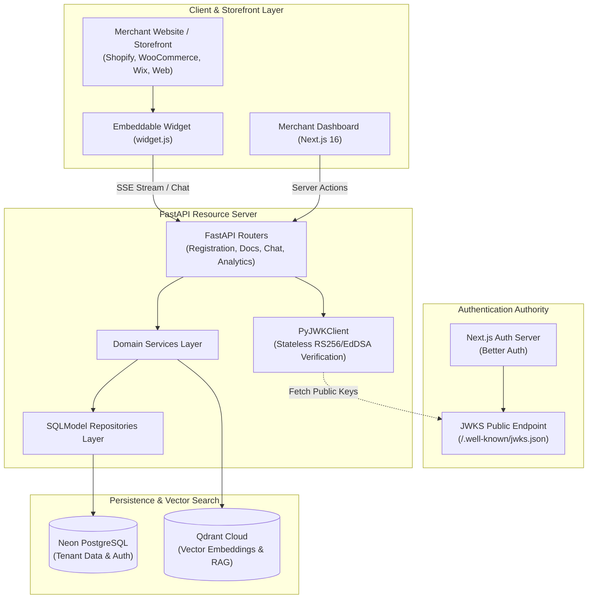
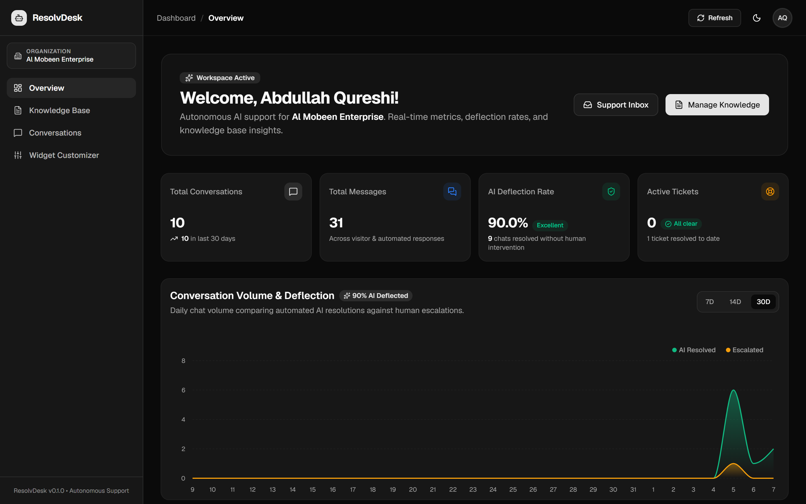
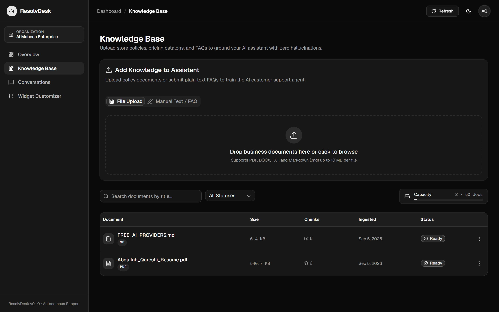
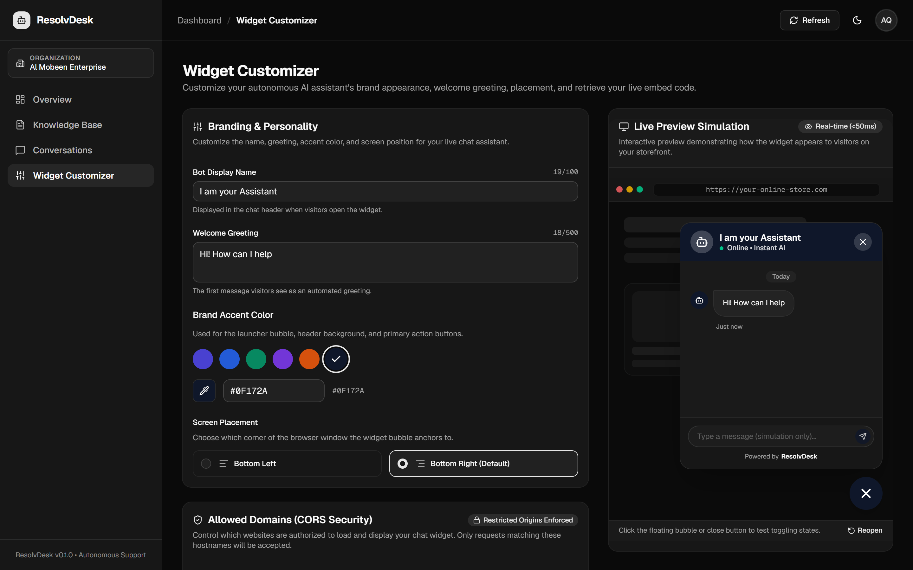
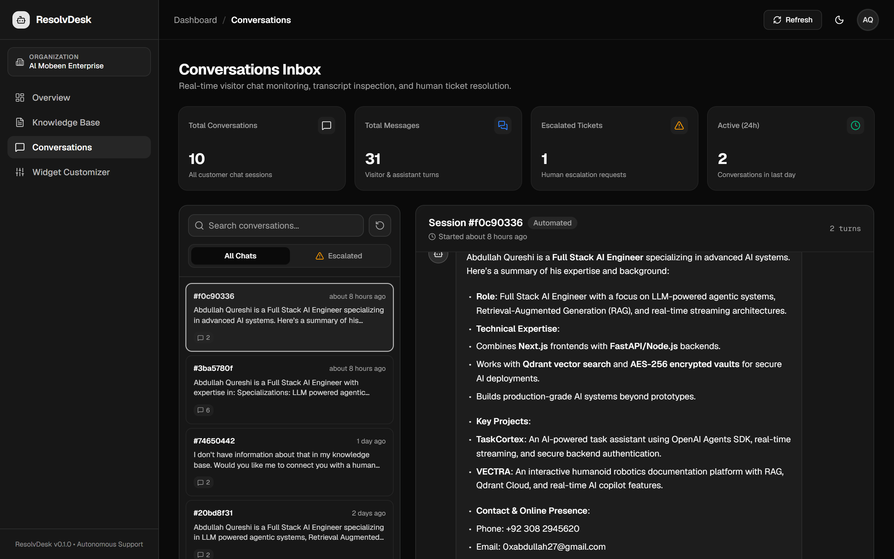

# ResolvDesk

### AI Customer Support for Business Websites

ResolvDesk is a multi-tenant AI customer-support platform that lets businesses deploy a knowledge-grounded chatbot on their website using a single embed script.

Businesses can upload their documents and FAQs, customize their chatbot, monitor conversations, and escalate conversations to human support.

**Built & maintained by Abdullah Qureshi**

[Live Demo](https://resolvdesk.online) · [Product Screenshots](#product-screenshots) · [Architecture](#architecture) · [Early Usage](#early-usage) · [Engineering Decisions](#engineering-decisions) · [Tech Stack](#tech-stack)

---

## Why I Built This

Most small businesses want an AI support chatbot but don't want to build their own RAG pipeline, knowledge ingestion system, authentication layer, and embeddable widget.

ResolvDesk combines these pieces into a self-serve platform.

---

## Product Flow

```text
Business signs up
       ↓
Creates organization
       ↓
Uploads knowledge
       ↓
Documents are chunked and embedded
       ↓
Vectors stored in Qdrant
       ↓
Customer asks a question
       ↓
Relevant knowledge retrieved
       ↓
AI generates grounded response
       ↓
Conversation can be escalated to human support
```

---

## <a id="architecture"></a>🏗️ System Architecture



---

## <a id="product-screenshots"></a>📸 Product Screenshots

### Merchant Dashboard
Live overview displaying real-time conversation volume, automated deflection rates, total processed messages, and active ticket metrics.


### Knowledge Base
Drag-and-drop document ingestion (PDF, DOCX, TXT, Markdown) and manual FAQ entry with automatic chunking, embedding, and vector index status.


### Website Chatbot
Real-time widget styling, custom greetings, brand colors, placement settings, CORS origin restrictions, and interactive storefront simulation preview.


### Conversation Management
Real-time visitor inbox monitoring, session inspection, grounded citation tracking, and conversation transcripts.


### Ticket Escalation & Human Handoff
Intelligent fallbacks and human escalation triggers when queries exceed knowledge base scope, preserving full conversation context for support staff.


---

## <a id="early-usage"></a>📈 Early Usage

ResolvDesk is currently being used by early merchants in real-world website environments.

The platform has been tested against real merchant knowledge bases and customer-support workflows.

> Usage metrics will be updated as the platform grows.

---

## <a id="engineering-decisions"></a>🧠 Engineering Decisions

### Why Qdrant?

ResolvDesk requires tenant-aware semantic retrieval over merchant knowledge. Qdrant provides vector search while allowing the application to enforce organization-level isolation.

### Why a separate FastAPI backend?

The backend is responsible for resource APIs, ingestion, retrieval, authentication verification, and AI workflows, allowing the frontend and AI infrastructure to evolve independently.

### Why JWKS-based JWT verification?

The API acts as a resource server and validates tokens against the authentication provider's public JWKS endpoint rather than trusting client-provided identity information.

### Why tenant isolation at the data layer?

Every organization-owned query is scoped by organization ID so that one merchant's knowledge cannot be retrieved by another merchant.

---

## <a id="tech-stack"></a>🛠️ Technology Stack

| Layer | Technology | Purpose |
| :--- | :--- | :--- |
| **Frontend Framework** | [Next.js 16 (Turbopack)](https://nextjs.org) | App Router, React Server Components (RSC), Server Actions |
| **State Management** | [Redux Toolkit](https://redux-toolkit.js.org) & React Context | Client caching and optimistic UI updates |
| **Styling & UI** | [Tailwind CSS v4](https://tailwindcss.com), shadcn/ui | Dark mode responsive interface |
| **Authentication** | [Better Auth](https://better-auth.com) | Session management, EdDSA JWT signing, JWKS public keys |
| **Backend API** | [FastAPI](https://fastapi.tiangolo.com) (Python 3.12) | Asynchronous 3-layer architecture (Router → Service → Repo) |
| **Database ORM** | [SQLModel](https://sqlmodel.tiangolo.com) & [asyncpg](https://github.com/MagicStack/asyncpg) | High-performance async PostgreSQL query pooling |
| **Migrations** | [Alembic](https://alembic.sqlalchemy.org) | Tracked database schema migrations |
| **Vector Database** | [Qdrant Cloud](https://qdrant.tech) | Tenant-isolated vector search for RAG grounding |
| **AI Providers** | [OpenAI](https://openai.com) / [Mistral](https://mistral.ai) / [Cohere](https://cohere.com) | Embeddings (`text-embedding-3-small`) and LLM chat completions |

---

## 🚀 Quickstart (Local Development)

### 1. Prerequisites
- **Node.js**: v20+ and `npm`
- **Python**: 3.12+ and [`uv`](https://docs.astral.sh/uv/)
- **PostgreSQL**: Neon Serverless PostgreSQL or local PostgreSQL instance

### 2. Backend Setup
```bash
cd backend

# 1. Install dependencies via uv
uv sync

# 2. Configure environment
cp .env.example .env

# 3. Run database migrations
uv run alembic upgrade head

# 4. Start the FastAPI development server
uv run uvicorn app.main:app --reload --port 8000
```
Interactive Swagger documentation is available at [http://localhost:8000/docs](http://localhost:8000/docs).

### 3. Frontend Setup
```bash
cd frontend

# 1. Install dependencies
npm install

# 2. Configure environment
cp .env.example .env.local

# 3. Start Next.js development server
npm run dev
```
Open [http://localhost:3000](http://localhost:3000) to view the application.

---

## 🧪 Testing & Verification

The backend includes a comprehensive test suite of **86 automated tests** (unit, contract, and multi-tenant integration tests):

```bash
cd backend
uv run pytest -v
```

```text
======================= 86 passed, 1 warning in 41.96s =======================
```

To run frontend type checking and production build verification:
```bash
cd frontend
npx tsc --noEmit
npm run build
```

---

## 🌐 Production Deployment (Vercel)

ResolvDesk is configured for **Vercel Multi-Service Deployment** via the root [`vercel.json`](./vercel.json). Both the Next.js frontend and FastAPI backend are deployed together in a single repository:

- **Frontend Service**: Serves all UI routes and Better Auth endpoints at `/api/auth/*`.
- **Backend Service**: Serves all REST APIs at `/api/v1/*`.

To deploy:
1. Import your GitHub repository into [Vercel](https://vercel.com).
2. Set your environment variables in **Settings → Environment Variables** (`DATABASE_URL`, `BETTER_AUTH_SECRET`, `BETTER_AUTH_URL`, `NEXT_PUBLIC_APP_URL`, `QDRANT_URL`, `QDRANT_API_KEY`, `OPENAI_API_KEY`).
3. Click **Deploy**.

---

## 👤 Author & Connect

**Abdullah Qureshi**  
*Full-Stack Engineer & AI Systems Developer*

- 🌐 **Portfolio & Personal Website**: [abdullah-qureshi.vercel.app](https://abdullah-qureshi.vercel.app)
- 💼 **LinkedIn**: [linkedin.com/in/abdullahqureshi27](https://www.linkedin.com/in/abdullahqureshi27)
- 🐙 **GitHub**: [@abdullahqureshi27](https://github.com/abdullahqureshi27)
- 🐦 **X (Twitter)**: [@abdullahqur27](https://x.com/abdullahqur27)
- ✉️ **Contact**: [mabdullahqureshi583@gmail.com](mailto:mabdullahqureshi583@gmail.com)

---

## 📄 License

This project is licensed under the MIT License — see the [LICENSE](LICENSE) file for details.
