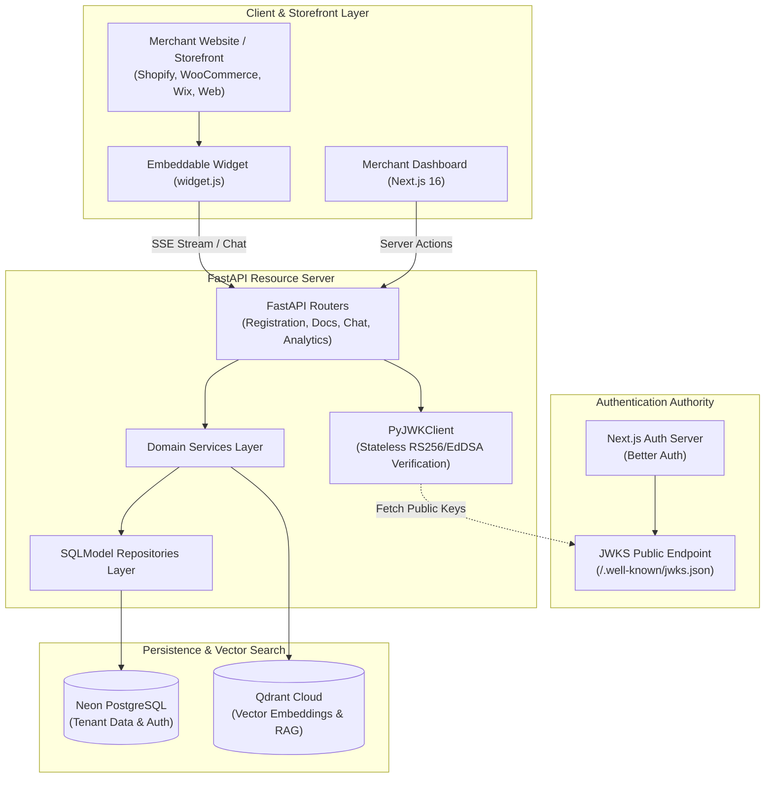

# ResolvDesk

<p align="center">
  <strong>Autonomous Multi-Tenant AI Customer Support Platform with Grounded RAG, Embeddable Storefront Widget, and Real-Time Ticket Escalation</strong>
</p>

<p align="center">
  <a href="https://resolvdesk.vercel.app"><strong>Live Demo</strong></a> •
  <a href="https://abdullah-qureshi.vercel.app"><strong>Portfolio</strong></a> •
  <a href="https://www.linkedin.com/in/abdullahqureshi27"><strong>LinkedIn</strong></a> •
  <a href="https://github.com/abdullahqureshi27"><strong>GitHub</strong></a> •
  <a href="https://x.com/abdullahqur27"><strong>X (Twitter)</strong></a>
</p>

<p align="center">
  
  
  
  
  
  
  
</p>

---

> **Created and Maintained by [Abdullah Qureshi](https://abdullah-qureshi.vercel.app)** — Full-Stack & AI Systems Engineer.

---

## 🌟 Key Features

- **🤖 Autonomous AI Customer Support**: Provides real-time streaming answers grounded strictly in merchant-provided documents using Retrieval-Augmented Generation (RAG).
- **🛍️ Universal Embeddable Storefront Widget**: Works with a 1-line script tag on **Shopify, WooCommerce, Wix, Squarespace**, or custom websites with zero configuration required.
- **🔄 Seamless Human Escalation & Ticket Management**: When an inquiry needs human intervention, the AI creates an escalation ticket with full conversation context preserved for owner review.
- **⚡ Instant Dashboard Navigation (<16ms)**: Persistent in-memory client caching eliminates loading skeleton flashes when switching between Overview, Conversations, Documents, and Widget settings.
- **🛡️ Multi-Tenant Isolation & Zero-Leak Guarantee**: Queries enforce tenant filtering at the database query level (`WHERE organization_id = ...`) ensuring complete cross-tenant boundary isolation.
- **🔐 Safe API Key Rotation**: Rotate public widget keys with an automatic 24-hour dual-key grace period so existing website embeds never drop traffic during updates.
- **📚 Multi-Format Knowledge Base**: Upload and ingest `.md`, `.txt`, `.pdf`, and `.docx` files with automated token-aware semantic chunking and vector indexing.

---

## 🏗️ System Architecture



---

## 🛠️ Technology Stack

| Layer | Technology | Purpose |
| :--- | :--- | :--- |
| **Frontend Framework** | [Next.js 16 (Turbopack)](https://nextjs.org) | App Router, React Server Components (RSC), Server Actions |
| **State Management** | [Redux Toolkit](https://redux-toolkit.js.org) & React Context | Client caching and optimistic UI updates |
| **Styling & UI** | [Tailwind CSS v4](https://tailwindcss.com), shadcn/ui | Dark mode responsive interface |
| **Authentication** | [Better Auth](https://better-auth.com) | Session management, EdDSA JWT signing, JWKS public keys |
| **Backend API** | [FastAPI](https://fastapi.tiangolo.com) (Python 3.12) | Asynchronous 3-layer architecture (Router → Service → Repo) |
| **Database ORM** | [SQLModel](https://sqlmodel.tiangolo.com) & [asyncpg](https://github.com/MagicStack/asyncpg) | High-performance async PostgreSQL query pooling |
| **Migrations** | [Alembic](https://alembic.sqlalchemy.org) | Tracked database schema migrations |
| **Vector Database** | [Qdrant Cloud](https://qdrant.tech) | Tenant-isolated vector search for RAG grounding |
| **AI Providers** | [OpenAI](https://openai.com) / [Mistral](https://mistral.ai) / [Cohere](https://cohere.com) | Embeddings (`text-embedding-3-small`) and LLM chat completions |

---

## 🚀 Quickstart (Local Development)

### 1. Prerequisites
- **Node.js**: v20+ and `npm`
- **Python**: 3.12+ and [`uv`](https://docs.astral.sh/uv/)
- **PostgreSQL**: Neon Serverless PostgreSQL or local PostgreSQL instance

### 2. Backend Setup
```bash
cd backend

# 1. Install dependencies via uv
uv sync

# 2. Configure environment
cp .env.example .env

# 3. Run database migrations
uv run alembic upgrade head

# 4. Start the FastAPI development server
uv run uvicorn app.main:app --reload --port 8000
```
Interactive Swagger documentation is available at [http://localhost:8000/docs](http://localhost:8000/docs).

### 3. Frontend Setup
```bash
cd frontend

# 1. Install dependencies
npm install

# 2. Configure environment
cp .env.example .env.local

# 3. Start Next.js development server
npm run dev
```
Open [http://localhost:3000](http://localhost:3000) to view the application.

---

## 🧪 Testing & Verification

The backend includes a comprehensive test suite of **86 automated tests** (unit, contract, and multi-tenant integration tests):

```bash
cd backend
uv run pytest -v
```

```text
======================= 86 passed, 1 warning in 41.96s =======================
```

To run frontend type checking and production build verification:
```bash
cd frontend
npx tsc --noEmit
npm run build
```

---

## 🌐 Production Deployment (Vercel)

ResolvDesk is configured for **Vercel Multi-Service Deployment** via the root [`vercel.json`](./vercel.json). Both the Next.js frontend and FastAPI backend are deployed together in a single repository:

- **Frontend Service**: Serves all UI routes and Better Auth endpoints at `/api/auth/*`.
- **Backend Service**: Serves all REST APIs at `/api/v1/*`.

To deploy:
1. Import your GitHub repository into [Vercel](https://vercel.com).
2. Set your environment variables in **Settings → Environment Variables** (`DATABASE_URL`, `BETTER_AUTH_SECRET`, `BETTER_AUTH_URL`, `NEXT_PUBLIC_APP_URL`, `QDRANT_URL`, `QDRANT_API_KEY`, `OPENAI_API_KEY`).
3. Click **Deploy**.

---

## 👤 Author & Connect

**Abdullah Qureshi**  
*Full-Stack Engineer & AI Systems Developer*

- 🌐 **Portfolio & Personal Website**: [abdullah-qureshi.vercel.app](https://abdullah-qureshi.vercel.app)
- 💼 **LinkedIn**: [linkedin.com/in/abdullahqureshi27](https://www.linkedin.com/in/abdullahqureshi27)
- 🐙 **GitHub**: [@abdullahqureshi27](https://github.com/abdullahqureshi27)
- 🐦 **X (Twitter)**: [@abdullahqur27](https://x.com/abdullahqur27)
- ✉️ **Contact**: [mabdullahqureshi583@gmail.com](mailto:mabdullahqureshi583@gmail.com)

---

## 📄 License

This project is licensed under the MIT License — see the [LICENSE](LICENSE) file for details.
