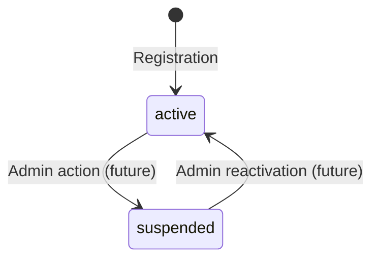
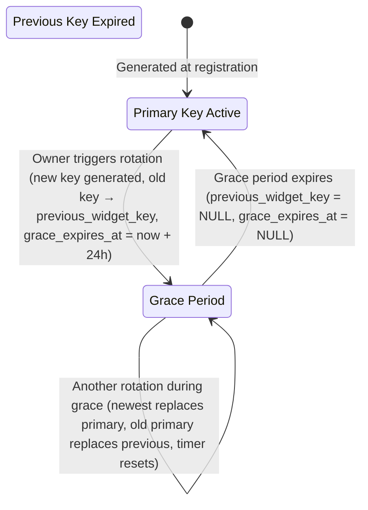

# Data Model: Multi-Tenant Organization & Owner Authentication Foundation

**Branch**: `001-tenant-auth-foundation` | **Date**: 2026-09-04

---

## Entity Relationship Diagram

```mermaid
erDiagram
    OWNER ||--|| ORGANIZATION : "belongs to (1:1)"
    ORGANIZATION ||--|| WIDGET_CONFIGURATION : "has one (1:1)"

    OWNER {
        uuid id PK "Immutable UUID primary key"
        string email UK "Unique, lowercase, indexed"
        string full_name "Required, max 200 chars"
        string status "active | suspended"
        datetime created_at "Auto-set on creation"
        datetime updated_at "Auto-set on mutation"
        uuid organization_id FK "Links to Organization"
    }

    ORGANIZATION {
        uuid id PK "Immutable UUID primary key"
        string display_name "Non-unique, max 200 chars"
        datetime created_at "Auto-set on creation"
        datetime updated_at "Auto-set on mutation"
    }

    WIDGET_CONFIGURATION {
        uuid id PK "Immutable UUID primary key"
        uuid organization_id FK_UK "Unique FK to Organization"
        string widget_key UK "Primary public key (rd_live_...)"
        string previous_widget_key "Nullable, rotated key in grace period"
        datetime grace_expires_at "Nullable, 24h after rotation"
        string primary_color "Default: #4F46E5"
        string bot_display_name "Default: Support Assistant"
        string welcome_message "Default: Hi! How can I help you today?"
        string widget_placement "Default: bottom-right"
        datetime created_at "Auto-set on creation"
        datetime updated_at "Auto-set on mutation"
    }
```

---

## Entity Details

### 1. Owner

The human account holder. Better Auth manages the credential columns (email, hashed password) in its own `user` table. The `Owner` table in FastAPI extends the auth identity with application-specific fields.

> **Important**: Better Auth automatically creates and manages `user`, `session`, and `account` tables in the shared Neon PostgreSQL database. The FastAPI `Owner` model references Better Auth's `user.id` as its primary key to avoid duplication.

| Column | Type | Constraints | Notes |
|---|---|---|---|
| `id` | `UUID` | PK, default `uuid4` | Same as Better Auth `user.id` |
| `email` | `VARCHAR(320)` | UNIQUE, NOT NULL, indexed | Lowercase-normalized. Mirrored from Better Auth for FastAPI queries without cross-service calls |
| `full_name` | `VARCHAR(200)` | NOT NULL | |
| `status` | `VARCHAR(20)` | NOT NULL, default `'active'` | Enum: `active`, `suspended` |
| `organization_id` | `UUID` | FK → `organization.id`, NOT NULL, indexed | Tenant linkage |
| `created_at` | `TIMESTAMPTZ` | NOT NULL, default `now()` | |
| `updated_at` | `TIMESTAMPTZ` | NOT NULL, default `now()` | Auto-updated on mutation |

**Validation Rules**:
- `email`: Must be valid email format, max 320 chars, stored lowercase.
- `full_name`: 1–200 characters, trimmed of leading/trailing whitespace.
- `status`: Must be one of `active`, `suspended`.

**Indexes**:
- `ix_owner_email` — UNIQUE on `email`
- `ix_owner_organization_id` — on `organization_id` (FK lookup, tenant queries)

---

### 2. Organization

The tenant container. All downstream data (documents, conversations, tickets) will be scoped to an Organization via `organization_id` foreign keys.

| Column | Type | Constraints | Notes |
|---|---|---|---|
| `id` | `UUID` | PK, default `uuid4` | Immutable tenant identifier |
| `display_name` | `VARCHAR(200)` | NOT NULL | Non-unique across tenants |
| `created_at` | `TIMESTAMPTZ` | NOT NULL, default `now()` | |
| `updated_at` | `TIMESTAMPTZ` | NOT NULL, default `now()` | Auto-updated on mutation |

**Validation Rules**:
- `display_name`: 1–200 characters, trimmed of leading/trailing whitespace.

**Indexes**:
- PK index on `id` (auto-created).

---

### 3. Widget Configuration

Embeddable chat widget settings for an Organization. One-to-one relationship with Organization.

| Column | Type | Constraints | Notes |
|---|---|---|---|
| `id` | `UUID` | PK, default `uuid4` | |
| `organization_id` | `UUID` | FK → `organization.id`, UNIQUE, NOT NULL | Ensures 1:1 with org |
| `widget_key` | `VARCHAR(64)` | UNIQUE, NOT NULL, indexed | Primary public key (`rd_live_` + `secrets.token_urlsafe(32)`) |
| `previous_widget_key` | `VARCHAR(64)` | NULLABLE | Rotated key in 24h grace period |
| `grace_expires_at` | `TIMESTAMPTZ` | NULLABLE | Set to `now() + 24h` on rotation; NULL when no grace active |
| `primary_color` | `VARCHAR(9)` | NOT NULL, default `'#4F46E5'` | Hex color code |
| `bot_display_name` | `VARCHAR(100)` | NOT NULL, default `'Support Assistant'` | |
| `welcome_message` | `VARCHAR(500)` | NOT NULL, default `'Hi! How can I help you today?'` | |
| `widget_placement` | `VARCHAR(20)` | NOT NULL, default `'bottom-right'` | Enum: `bottom-right`, `bottom-left` |
| `created_at` | `TIMESTAMPTZ` | NOT NULL, default `now()` | |
| `updated_at` | `TIMESTAMPTZ` | NOT NULL, default `now()` | Auto-updated on mutation |

**Validation Rules**:
- `widget_key`: Auto-generated, never user-editable. Format: `rd_live_` + 43 chars (from `secrets.token_urlsafe(32)`).
- `primary_color`: Must match hex color regex `^#[0-9A-Fa-f]{6}$`.
- `bot_display_name`: 1–100 characters.
- `welcome_message`: 1–500 characters.
- `widget_placement`: Must be one of `bottom-right`, `bottom-left`.
- `grace_expires_at`: Must be NULL when `previous_widget_key` is NULL, and non-NULL when `previous_widget_key` is set.

**Indexes**:
- `ix_widget_config_widget_key` — UNIQUE on `widget_key`
- `ix_widget_config_organization_id` — UNIQUE on `organization_id`
- `ix_widget_config_previous_widget_key` — on `previous_widget_key` (for grace period lookups)

---

### 4. Auth Session / Token Claims (Managed by Better Auth)

Better Auth manages the `session` table internally. The JWT token issued by Better Auth contains these claims that FastAPI reads:

| Claim | Type | Source | Notes |
|---|---|---|---|
| `sub` | `string` | Better Auth `user.id` | Maps to `Owner.id` |
| `iat` | `integer` | Better Auth | Token issuance timestamp (Unix epoch) |
| `exp` | `integer` | Better Auth | Token expiration timestamp (7-day sliding window) |

> **Note**: `organization_id` is resolved by looking up the `Owner` record using the `sub` claim. An alternative is to embed `organization_id` as a custom JWT claim in Better Auth — this avoids a DB lookup per request but requires a Better Auth plugin hook. The recommended approach for v1 is the DB lookup since it guarantees consistency if the owner's org ever changes.

---

## State Transitions

### Owner Status


### Widget Key Rotation


---

## Registration Transaction Boundary

The following records MUST be created atomically within a single database transaction during owner registration:

1. `Organization` record (created first, generates `id`)
2. `Owner` record (references `organization.id`)
3. `Widget Configuration` record (references `organization.id`, generates `widget_key`)

If any step fails, the entire transaction rolls back. No orphaned records are permitted.
