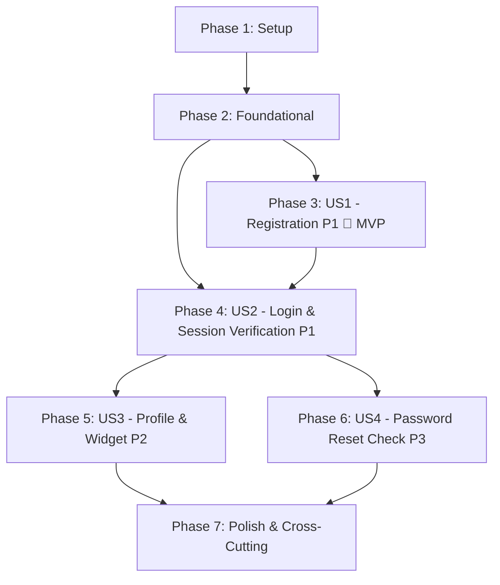

# Tasks: Multi-Tenant Organization & Owner Authentication Foundation (Backend First)

**Input**: Design documents from `/specs/001-tenant-auth-foundation/`  
**Prerequisites**: [plan.md](./plan.md) (required), [spec.md](./spec.md) (required), [research.md](./research.md), [data-model.md](./data-model.md), [contracts/api.md](./contracts/api.md), [quickstart.md](./quickstart.md)

**Scope**: Strictly **Backend-First**. Establishes the FastAPI Resource Server (data models, Alembic migrations, tenant-isolated repos, transactional services, routers, and test suites), plus minimal Better Auth configuration in Next.js for JWKS exposure. Frontend UI forms, pages, and dashboard components are deferred to a subsequent frontend milestone.

**Tests**: Included per Constitution quality gates (Principle I tenant isolation, contract verification, schema validation).

---

## Format: `- [ ] [TaskID] [P?] [Story?] Description with file path`

- **[P]**: Can run in parallel (different files, no dependencies on incomplete tasks)
- **[Story]**: Which user story this task belongs to (e.g. `[US1]`, `[US2]`, `[US3]`, `[US4]`)
- Every task specifies exact file paths

---

## Phase 1: Setup (Backend Scaffolding & Infrastructure)

**Purpose**: Backend project initialization, environment settings, database connection, and migrations framework.

- [X] T001 Add FastAPI, SQLModel, asyncpg, Alembic, and PyJWT dependencies to backend uv project in `backend/pyproject.toml`
- [X] T002 [P] Configure environment settings and Pydantic Settings in `backend/app/core/config.py`
- [X] T003 [P] Setup asyncpg database engine, sessionmaker, and connection pooling in `backend/app/core/database.py`
- [X] T004 [P] Configure Alembic async migrations environment in `backend/alembic.ini` and `backend/alembic/env.py`
- [X] T005 [P] Setup test suite fixtures, test database session, and HTTP test client in `backend/tests/conftest.py`
- [X] T006 Add Better Auth dependency to Next.js 16 project in `frontend/package.json`

---

## Phase 2: Foundational (Core Auth & Database Prerequisites)

**Purpose**: Core data models and authentication infrastructure that MUST be complete before ANY user story can be implemented.

**⚠️ CRITICAL**: No user story work can begin until this phase is complete.

- [X] T007 [P] Implement SQLModel entities for Organization, Owner, and Widget in `backend/app/models/organization.py`, `backend/app/models/owner.py`, and `backend/app/models/widget.py`
- [X] T008 Generate and apply initial database schema migration in `backend/alembic/versions/001_initial_auth_tables.py`
- [X] T009 [P] Setup Better Auth server configuration with JWT and JWKS plugins in `frontend/lib/auth.ts`
- [X] T010 [P] Implement Next.js catch-all route handler exposing Better Auth and JWKS endpoint in `frontend/app/api/auth/[...all]/route.ts`
- [X] T011 Implement PyJWKClient JWT signature verification dependency with key caching in `backend/app/core/auth.py`
- [X] T012 [P] Implement development authentication test token generator (FR-012) in `backend/app/core/auth.py`
- [X] T013 Setup FastAPI application with CORS middleware, error handlers, and router mounting in `backend/app/main.py`

**Checkpoint**: Foundation ready — user story implementation can now begin.

---

## Phase 3: User Story 1 - Business Owner Account & Organization Registration (Priority: P1) 🎯 MVP

**Goal**: Enable atomic backend provisioning of the Owner account, Organization workspace, and default Widget configuration in a single PostgreSQL transaction (`POST /api/v1/registration/complete`).

**Independent Test**: Call `POST /api/v1/registration/complete` with valid registration payload; verify that Owner, Organization, and Widget rows are simultaneously inserted with linked foreign keys; verify that simulated errors trigger a full rollback leaving 0 orphaned records.

### Tests for User Story 1

- [X] T014 [P] [US1] Contract test for registration complete endpoint in `backend/tests/contract/test_registration_contract.py`
- [X] T015 [P] [US1] Integration test for atomic multi-table rollback on provisioning failure in `backend/tests/integration/test_registration_atomicity.py`

### Implementation for User Story 1

- [X] T016 [P] [US1] Define Pydantic request and response schemas for registration in `backend/app/schemas/registration.py`
- [X] T017 [P] [US1] Implement organization and owner database queries in `backend/app/repos/organization_repo.py`
- [X] T018 [P] [US1] Implement widget database queries in `backend/app/repos/widget_repo.py`
- [X] T019 [US1] Implement RegistrationService orchestrating atomic multi-table transaction in `backend/app/services/registration_service.py`
- [X] T020 [US1] Implement registration endpoint `POST /api/v1/registration/complete` in `backend/app/routers/registration.py`

**Checkpoint**: User Story 1 is fully functional and testable independently (Backend MVP complete).

---

## Phase 4: User Story 2 - Secure Owner Login & Session Verification (Priority: P1)

**Goal**: Provide stateless JWT Bearer token authentication and owner context resolution (`GET /api/v1/me`) on the FastAPI resource server.

**Independent Test**: Issue a signed JWT; verify FastAPI decodes claims and resolves owner profile via `GET /api/v1/me`; verify expired or tampered tokens return 401 Unauthorized.

### Tests for User Story 2

- [X] T021 [P] [US2] Unit tests for JWT signature verification, claims parsing, and expired token rejection in `backend/tests/unit/test_jwt_auth.py`
- [X] T022 [P] [US2] Contract test for authenticated owner profile endpoint `GET /api/v1/me` in `backend/tests/contract/test_me_contract.py`

### Implementation for User Story 2

- [X] T023 [P] [US2] Define Pydantic schema for owner profile response in `backend/app/schemas/organization.py`
- [X] T024 [US2] Implement owner profile repository query by `user_id` in `backend/app/repos/organization_repo.py`
- [X] T025 [US2] Implement authenticated owner current profile endpoint `GET /api/v1/me` in `backend/app/routers/organizations.py`

**Checkpoint**: User Stories 1 and 2 are fully functional and integrated on the backend.

---

## Phase 5: User Story 3 - Organization Profile & Default Widget Provisioning (Priority: P2)

**Goal**: Expose endpoints for authenticated organization profile retrieval, widget key rotation with 24-hour grace window, and unauthenticated public widget configuration for visitors with strict query-level tenant isolation.

**Independent Test**: Query organization profile as Owner 1 and verify tenant query isolation strictly prevents Owner 2 from reading or modifying it (403 Forbidden); trigger widget key rotation and verify both primary and grace keys resolve for 24 hours; verify unauthenticated visitor can fetch public widget config via `GET /api/v1/widget/config?key=rd_live_...`.

### Tests for User Story 3

- [X] T026 [P] [US3] Integration test verifying strict multi-tenant query isolation (`WHERE organization_id = ...`) and cross-tenant 403 rejection in `backend/tests/integration/test_tenant_isolation.py`
- [X] T027 [P] [US3] Contract test for widget key rotation and public widget config endpoints in `backend/tests/contract/test_widget_contract.py`

### Implementation for User Story 3

- [X] T028 [P] [US3] Define Pydantic schemas for organization profile, key rotation, and widget config in `backend/app/schemas/organization.py` and `backend/app/schemas/widget.py`
- [X] T029 [US3] Implement OrganizationService for profile retrieval and tenant validation in `backend/app/services/organization_service.py`
- [X] T030 [P] [US3] Implement WidgetService supporting key generation and 24-hour grace rotation in `backend/app/services/widget_service.py`
- [X] T031 [US3] Implement organization profile endpoint `GET /api/v1/organization/profile` in `backend/app/routers/organizations.py`
- [X] T032 [US3] Implement key rotation endpoint `POST /api/v1/organization/widget/rotate-key` in `backend/app/routers/organizations.py`
- [X] T033 [US3] Implement unauthenticated public widget configuration endpoint `GET /api/v1/widget/config` in `backend/app/routers/widget.py`

**Checkpoint**: User Stories 1, 2, and 3 are functional and strictly isolated on the backend.

---

## Phase 6: User Story 4 - Account Password Recovery & Security Reset (Priority: P3)

**Goal**: Ensure the backend auth dependency enforces session invalidation and account status checks following password reset events.

**Independent Test**: Simulate password reset; verify that revoked or suspended owner accounts are rejected at the FastAPI auth boundary.

### Tests for User Story 4

- [X] T034 [P] [US4] Integration test verifying suspended or revoked owner credentials cannot access protected FastAPI endpoints in `backend/tests/integration/test_session_invalidation.py`

### Implementation for User Story 4

- [X] T035 [US4] Implement owner account status verification (`status == 'active'`) in FastAPI auth dependency `backend/app/core/auth.py`

**Checkpoint**: All 4 User Stories have backend enforcement.

---

## Phase 7: Polish & Cross-Cutting Concerns

**Purpose**: System-wide hardening, structured logging, OpenAPI documentation, and end-to-end quickstart validation.

- [X] T036 [P] Implement structured logging with tenant context and request correlation ID in `backend/app/core/logging.py`
- [X] T037 [P] Configure OpenAPI documentation tags, security schemes, and error schemas in `backend/app/main.py`
- [X] T038 Run backend automated test suite and verify all scenarios in `specs/001-tenant-auth-foundation/quickstart.md`
- [X] T039 Update backend setup and verification instructions in `README.md`

---

## Dependencies & Execution Order

### Phase Dependencies



- **Setup (Phase 1)**: Can start immediately (no dependencies).
- **Foundational (Phase 2)**: Depends on Phase 1; **BLOCKS all user stories**.
- **User Story 1 (Phase 3)**: Depends on Phase 2. Establishes owner, organization, and widget database rows.
- **User Story 2 (Phase 4)**: Depends on Phase 2 and integrates with US1 for authentication credentials.
- **User Story 3 (Phase 5)**: Depends on Phase 4 (requires authenticated owner context).
- **User Story 4 (Phase 6)**: Depends on Phase 4.
- **Polish (Phase 7)**: Depends on completion of desired user stories.

---

## Parallel Execution Opportunities

### Phase 1 & 2 (Foundational)
```text
Parallel Stream A (Backend Core): T001 -> T002 -> T003 -> T004 -> T005 -> T007 -> T008 -> T011 -> T012 -> T013
Parallel Stream B (Auth Provider): T006 -> T009 -> T010
```

### User Story 1 (Registration MVP)
```text
Parallel Stream A (Tests): T014 & T015
Parallel Stream B (Repos & Schemas): T016 -> T017 & T018 -> T019 -> T020
```

### User Story 3 (Profile & Widget)
```text
Parallel Stream A (Tests): T026 & T027
Parallel Stream B (Schemas & Services): T028 -> T029 & T030 -> T031, T032, T033
```

---

## Implementation Strategy & MVP

### MVP Scope (Phases 1, 2, and 3)
1. Complete **Phase 1: Setup** and **Phase 2: Foundational**.
2. Complete **Phase 3: User Story 1 (Registration)**.
3. **Validate MVP**: Ensure `POST /api/v1/registration/complete` atomically creates the Owner, Organization, and Widget rows in PostgreSQL and rolls back completely on any simulated failure.

### Incremental Milestones
- **Increment 1 (MVP)**: User Story 1 complete — atomic multi-tenant registration endpoint working.
- **Increment 2**: User Story 2 complete — JWT verification dependency and owner `GET /api/v1/me` profile endpoint working.
- **Increment 3**: User Story 3 complete — profile retrieval with strict query tenant isolation (`WHERE organization_id = ...`), widget key rotation with 24-hour grace window, and public unauthenticated widget configuration endpoint working.
- **Increment 4**: User Story 4 complete — inactive/suspended account status enforcement verified.
- **Increment 5**: Phase 7 Polish complete — full pytest suite passes and quickstart scenarios verified.
