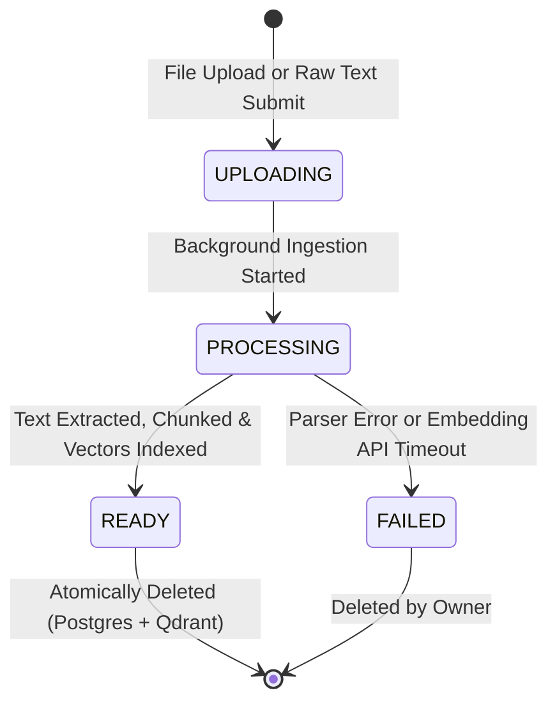

# Data Model: Knowledge Base Document Ingestion Pipeline

**Feature**: `002-knowledge-base-ingestion`  
**Date**: 2026-09-04  
**Status**: Completed

---

## 1. Relational Model: `Document` (PostgreSQL / SQLModel)

The `Document` entity tracks file metadata, processing status, extracted character/chunk statistics, and ownership.

### Entity Schema

```python
import uuid
from datetime import datetime, timezone
from enum import Enum
from typing import Optional
from sqlmodel import Field, SQLModel


class DocumentStatus(str, Enum):
    UPLOADING = "uploading"
    PROCESSING = "processing"
    READY = "ready"
    FAILED = "failed"


class DocumentType(str, Enum):
    PDF = "pdf"
    DOCX = "docx"
    TXT = "txt"
    MD = "md"
    RAW = "raw"


class DocumentBase(SQLModel):
    title: str = Field(max_length=255, nullable=False, description="Filename or manual snippet title")
    file_type: DocumentType = Field(nullable=False, description="Document source format")
    file_size_bytes: int = Field(default=0, ge=0, description="File size in bytes (0 for raw text)")


class Document(DocumentBase, table=True):
    __tablename__ = "documents"

    id: uuid.UUID = Field(
        default_factory=uuid.uuid4,
        primary_key=True,
        index=True,
        nullable=False,
    )
    organization_id: uuid.UUID = Field(
        foreign_key="organizations.id",
        nullable=False,
        index=True,
        description="Strict tenant isolation foreign key",
    )
    status: DocumentStatus = Field(
        default=DocumentStatus.UPLOADING,
        nullable=False,
        index=True,
        description="Ingestion lifecycle status",
    )
    chunk_count: int = Field(
        default=0,
        ge=0,
        nullable=False,
        description="Total semantic vector chunks indexed",
    )
    character_count: int = Field(
        default=0,
        ge=0,
        nullable=False,
        description="Total extracted plain text characters",
    )
    content_preview: Optional[str] = Field(
        default=None,
        max_length=500,
        nullable=True,
        description="First 500 characters of extracted text for dashboard inspection",
    )
    error_message: Optional[str] = Field(
        default=None,
        max_length=1000,
        nullable=True,
        description="Failure reason if ingestion failed",
    )
    created_at: datetime = Field(
        default_factory=lambda: datetime.now(timezone.utc),
        nullable=False,
    )
    updated_at: datetime = Field(
        default_factory=lambda: datetime.now(timezone.utc),
        nullable=False,
    )
```

### Constraints & Indexes
- `id`: Primary Key (UUID)
- `organization_id`: Foreign Key (`organizations.id`), Indexed. Mandatory in every query filter (`WHERE organization_id = :org_id`).
- `status`: Indexed for status queries and background task polling.
- Unique Constraint: `UniqueConstraint("organization_id", "title", name="uq_documents_org_title")` enforcing filename/title uniqueness per tenant (FR-013).
- Composite Index: `(organization_id, created_at DESC)` for efficient paginated document listings.

### State Transitions



---

## 2. Vector Model: `DocumentChunk` (Qdrant Vector Database)

Embeddings are strictly stored in Qdrant, completely segregated from relational tables (per Constitution).

### Collection Configuration
- **Collection Name**: `resolvdesk_documents`
- **Vector Size**: `1536` (matching `text-embedding-3-small`)
- **Distance**: `Cosine`
- **HNSW Indexing**: Enabled on vector search

### Payload Schema (Point Metadata)

| Field | Type | Indexed | Description |
|---|---|---|---|
| `id` | `UUID` / `str` | Yes (PK) | Unique chunk ID |
| `organization_id` | `str` | **Yes (Keyword)** | Mandatory tenant filter for query isolation |
| `document_id` | `str` | **Yes (Keyword)** | Parent document ID for cascade purging |
| `chunk_index` | `int` | No | Zero-based sequence index within document |
| `text` | `str` | No | Extracted text chunk (~500 tokens) |
| `token_count` | `int` | No | Exact token count of the chunk |
| `title` | `str` | No | Title / filename of source document |
| `created_at` | `str` | No | ISO 8601 UTC timestamp |

### Tenant Isolation Filter Requirement
Every retrieval search MUST enforce:
```python
from qdrant_client.http import models

tenant_filter = models.Filter(
    must=[
        models.FieldCondition(
            key="organization_id",
            match=models.MatchValue(value=str(organization_id)),
        )
    ]
)
```
Zero queries may execute without this filter.
