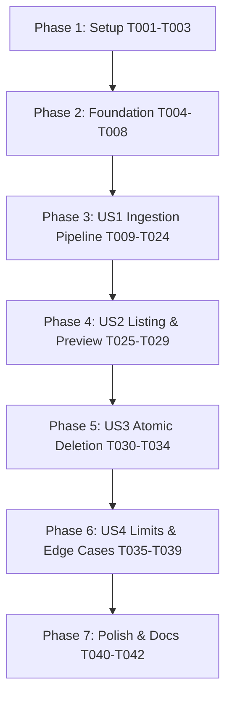

# Tasks: Knowledge Base Document Ingestion Pipeline (Backend First)

**Input**: Design documents from `/specs/002-knowledge-base-ingestion/`  
**Prerequisites**: [plan.md](./plan.md) (required), [spec.md](./spec.md) (required), [research.md](./research.md), [data-model.md](./data-model.md), [contracts/api.md](./contracts/api.md), [quickstart.md](./quickstart.md)

**Scope**: Strictly **Backend-First**. Establishes file parsers (PDF, DOCX, TXT, Markdown `.md`), token-based semantic chunker (500 tokens / 50 overlap), provider-agnostic embeddings client, Qdrant vector store integration with strict tenant isolation, background ingestion lifecycle, and atomic cross-store deletion.

**Tests**: Included per Constitution quality gates (Principle I tenant isolation, contract verification, schema validation, cross-store atomicity).

---

## Format: `- [ ] [TaskID] [P?] [Story?] Description with file path`

- **[P]**: Can run in parallel (different files, no dependencies on incomplete tasks)
- **[Story]**: Which user story this task belongs to (`[US1]`, `[US2]`, `[US3]`, `[US4]`)
- Every task specifies exact file paths

---

## Phase 1: Setup (Dependencies & Configuration)

**Purpose**: Add required backend dependencies and vector store / embedding environment configuration.

- [ ] T001 Add `pypdf`, `python-docx`, `python-multipart`, `tiktoken`, and `qdrant-client` dependencies to `backend/pyproject.toml`
- [ ] T002 [P] Configure Qdrant and OpenAI-compatible embedding settings in `backend/app/core/config.py`
- [ ] T003 [P] Define custom exceptions for capacity limits (400), payload limits (413), and unsupported formats (415) in `backend/app/core/exceptions.py`

---

## Phase 2: Foundational (Data Model & Vector Store Infrastructure)

**Purpose**: Core `Document` relational model, Alembic database migration, and Qdrant vector repository client that all document operations depend upon.

**⚠️ CRITICAL**: No user story work can begin until this phase is complete.

- [ ] T004 [P] Implement `Document` SQLModel entity and enums (`DocumentStatus`, `DocumentType`) in `backend/app/models/document.py`
- [ ] T005 [P] Register `Document` in `backend/app/models/__init__.py`
- [ ] T006 Create and apply Alembic migration for documents table in `backend/alembic/versions/002_create_documents_table.py`
- [ ] T007 [P] Implement Qdrant vector store client initialization, collection ensure, and payload indexing in `backend/app/repos/vector_repo.py`
- [ ] T008 Implement PostgreSQL `DocumentRepository` with strict `organization_id` tenant filtering in `backend/app/repos/document_repo.py`

**Checkpoint**: Foundation ready — user story implementation can now begin.

---

## Phase 3: User Story 1 - Multi-Format Document Upload & Ingestion (Priority: P1) 🎯 MVP

**Goal**: Enable business owners to upload documents (PDF, DOCX, TXT, Markdown `.md`) or submit raw text snippets, extracting text, splitting into ~500-token chunks with 50-token overlap, computing embeddings via an OpenAI-compatible endpoint, and indexing them into Qdrant under the organization's tenant ID.

**Independent Test**: Upload a sample Markdown (`.md`), PDF, TXT, or raw text snippet via API; verify document reaches `ready` state, extracted text is chunked, and vector embeddings are stored in Qdrant with `organization_id` payload.

### Tests for User Story 1

- [ ] T009 [P] [US1] Unit tests for PDF, DOCX, TXT, and Markdown parsers (verifying header structure preservation in Markdown) in `backend/tests/unit/test_document_parsers.py`
- [ ] T010 [P] [US1] Unit tests for token chunker verifying 500-token target, 50-token overlap, and boundary splitting in `backend/tests/unit/test_chunker.py`
- [ ] T011 [P] [US1] Contract test for document upload endpoint `POST /api/v1/documents/upload` in `backend/tests/contract/test_documents_contract.py`
- [ ] T012 [P] [US1] Contract test for raw text ingestion endpoint `POST /api/v1/documents/raw` in `backend/tests/contract/test_documents_contract.py`
- [ ] T013 [P] [US1] Integration test for complete upload -> extract -> chunk -> embed -> Qdrant indexing flow in `backend/tests/integration/test_document_ingestion.py`

### Implementation for User Story 1

- [ ] T014 [P] [US1] Define Pydantic request and response schemas (`DocumentRead`, `DocumentListResponse`, `RawDocumentCreate`) in `backend/app/schemas/document.py`
- [ ] T015 [P] [US1] Implement in-memory PDF text parser using `pypdf` in `backend/app/services/parsers/pdf_parser.py`
- [ ] T016 [P] [US1] Implement DOCX text parser using `python-docx` in `backend/app/services/parsers/docx_parser.py`
- [ ] T017 [P] [US1] Implement TXT and Markdown (`.md`) text parser preserving markdown headers and structure in `backend/app/services/parsers/text_parser.py`
- [ ] T018 [P] [US1] Implement parser registry dispatcher in `backend/app/services/parsers/__init__.py`
- [ ] T019 [P] [US1] Implement token chunking service using `tiktoken` in `backend/app/services/chunker_service.py`
- [ ] T020 [P] [US1] Implement provider-agnostic OpenAI-compatible embedding client using `httpx.AsyncClient` in `backend/app/services/embedding_service.py`
- [ ] T021 [US1] Implement background ingestion pipeline service coordinating extract, chunk, embed, and Qdrant upsert in `backend/app/services/ingestion_service.py`
- [ ] T022 [US1] Implement document upload endpoint `POST /api/v1/documents/upload` with background task execution in `backend/app/routers/documents.py`
- [ ] T023 [US1] Implement raw text snippet endpoint `POST /api/v1/documents/raw` in `backend/app/routers/documents.py`
- [ ] T024 [US1] Mount documents router in `backend/app/main.py`

**Checkpoint**: User Story 1 is fully functional and testable independently (Backend MVP complete).

---

## Phase 4: User Story 2 - Document Listing, Inspection & Status Tracking (Priority: P1)

**Goal**: Allow business owners to list all uploaded documents, inspect their processing status, chunk count, file size, and inspect a 500-character plain text preview with strict query-level tenant isolation.

**Independent Test**: Call `GET /api/v1/documents` and verify all tenant documents are returned; call `GET /api/v1/documents/{id}` and verify content preview; verify Owner 2 cannot view Owner 1's document (returns 404).

### Tests for User Story 2

- [ ] T025 [P] [US2] Contract test for `GET /api/v1/documents` and `GET /api/v1/documents/{id}` in `backend/tests/contract/test_documents_contract.py`
- [ ] T026 [P] [US2] Integration test verifying strict multi-tenant isolation prevents cross-organization document inspection in `backend/tests/integration/test_document_ingestion.py`

### Implementation for User Story 2

- [ ] T027 [US2] Implement paginated listing and single document query with tenant filtering in `backend/app/services/document_service.py`
- [ ] T028 [US2] Implement `GET /api/v1/documents` endpoint in `backend/app/routers/documents.py`
- [ ] T029 [US2] Implement `GET /api/v1/documents/{document_id}` endpoint returning metadata and 500-character preview in `backend/app/routers/documents.py`

**Checkpoint**: User Stories 1 and 2 are fully functional and integrated.

---

## Phase 5: User Story 3 - Cross-Store Atomic Document Deletion (Priority: P2)

**Goal**: Provide atomic deletion of a document across both PostgreSQL and Qdrant vector store, guaranteeing zero orphan vector chunks and rollback if vector purge fails.

**Independent Test**: Call `DELETE /api/v1/documents/{id}`; verify relational row is removed from PostgreSQL AND zero vector points remain in Qdrant; simulate Qdrant error and verify PostgreSQL delete is rolled back.

### Tests for User Story 3

- [ ] T030 [P] [US3] Contract test for `DELETE /api/v1/documents/{id}` in `backend/tests/contract/test_documents_contract.py`
- [ ] T031 [P] [US3] Integration test for atomic cross-store deletion and rollback on vector purge failure in `backend/tests/integration/test_document_ingestion.py`

### Implementation for User Story 3

- [ ] T032 [US3] Implement vector point purge by `document_id` and `organization_id` in `backend/app/repos/vector_repo.py`
- [ ] T033 [US3] Implement atomic cross-store deletion orchestrator in `backend/app/services/document_service.py`
- [ ] T034 [US3] Implement `DELETE /api/v1/documents/{document_id}` endpoint in `backend/app/routers/documents.py`

**Checkpoint**: User Stories 1, 2, and 3 are fully functional.

---

## Phase 6: User Story 4 - File Validation, Capacity Limits & Edge Cases (Priority: P3)

**Goal**: Enforce 10 MB file size limit (`413 Payload Too Large`), unsupported format rejection (`415 Unsupported Media Type`), and 50 documents per organization limit (`400 Bad Request`).

**Independent Test**: Attempt uploading an 11 MB file (returns 413), an unsupported `.exe` (returns 415), or a 51st document (returns 400); verify clear, actionable error details.

### Tests for User Story 4

- [ ] T035 [P] [US4] Contract tests for 413 Payload Too Large, 415 Unsupported Media Type, and 400 Capacity Limit in `backend/tests/contract/test_documents_contract.py`
- [ ] T036 [P] [US4] Unit test for organization document count constraint check in `backend/tests/unit/test_document_service.py`

### Implementation for User Story 4

- [ ] T037 [US4] Implement file size and format pre-validation middleware/dependency in `backend/app/routers/documents.py`
- [ ] T038 [US4] Implement organization document capacity check (max 50) in `backend/app/services/document_service.py`
- [ ] T039 [US4] Register custom exception handlers for 413, 415, and 400 in `backend/app/main.py`

---

## Phase 7: Polish & Documentation

**Purpose**: End-to-end verification, test execution, and cleanup.

- [ ] T040 Run full automated test suite (`uv run pytest tests/ -v`) and verify 100% pass rate
- [ ] T041 Verify OpenAPI documentation and Swagger schema at `/docs`
- [ ] T042 Update Git with conventional commit and push branch `002-knowledge-base-ingestion`

---

## Dependencies & Execution Order

### Parallel Execution Opportunities
- Parsers (`pdf_parser.py`, `docx_parser.py`, `text_parser.py`) can be implemented in parallel.
- Contract tests and Unit tests can be authored in parallel with schemas and models.
- US2 (Listing) and US3 (Deletion) can be implemented in parallel once US1 ingestion models and repos are complete.
