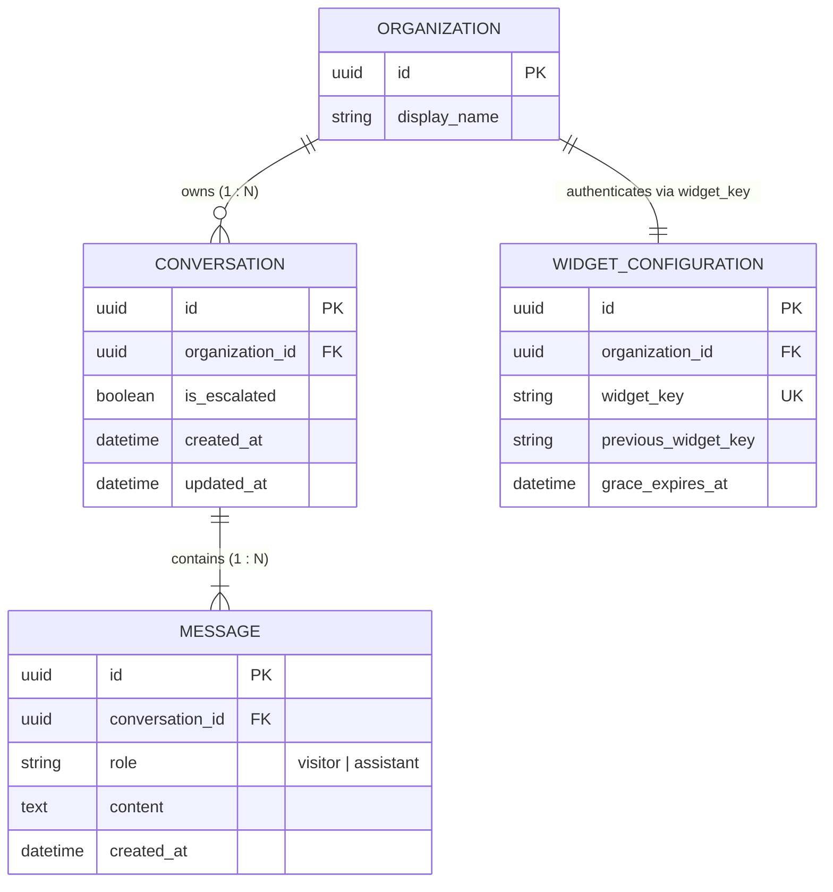
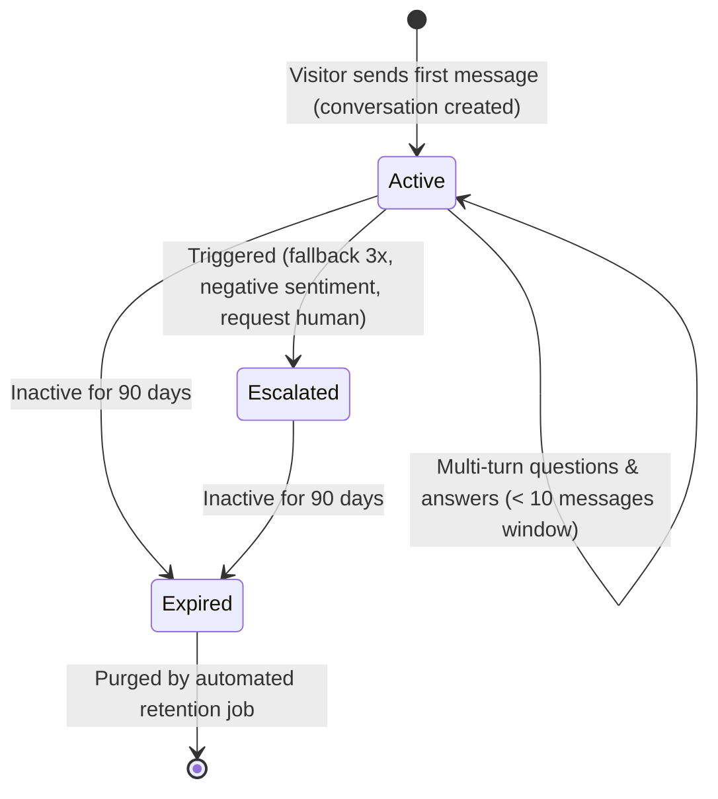

# Data Model: AI Answer Engine & Streaming Chat API

**Feature**: `003-ai-answer-engine`  
**Date**: 2026-09-04  
**Status**: Completed  

---

## 1. Relational Entities (PostgreSQL via SQLModel)

### 1.1 `Conversation` Entity
Represents an ongoing or completed chat session between an anonymous visitor and the AI assistant, strictly scoped to an Organization.

```text
Table: conversations
```

| Column | Type | Constraints | Description |
| :--- | :--- | :--- | :--- |
| `id` | `UUID` | Primary Key, Indexed | Unique identifier for the chat session |
| `organization_id` | `UUID` | Foreign Key (`organizations.id`), Indexed, Not Null | Strict tenant ownership |
| `is_escalated` | `Boolean` | Default `False`, Not Null | Flag indicating whether this session was escalated to a support ticket |
| `created_at` | `DateTime(timezone=True)` | Default `utcnow`, Not Null | When the chat session started |
| `updated_at` | `DateTime(timezone=True)` | Default `utcnow`, Not Null | Timestamp of most recent activity in session |

#### Constraints & Indexes:
- `ix_conversations_organization_id`: For tenant-scoped dashboard queries and automated 90-day retention cleanup.
- `ix_conversations_updated_at`: For ordering conversation inboxes and age calculation.

---

### 1.2 `Message` Entity
Represents a single conversational turn (visitor inquiry, assistant response, or system notice).

```text
Table: messages
```

| Column | Type | Constraints | Description |
| :--- | :--- | :--- | :--- |
| `id` | `UUID` | Primary Key, Indexed | Unique message identifier |
| `conversation_id` | `UUID` | Foreign Key (`conversations.id`, ondelete="CASCADE"), Indexed, Not Null | Parent conversation session |
| `role` | `String` / Enum | Values: `visitor`, `assistant`, `system`, Not Null | Message speaker identity |
| `content` | `Text` | Not Null | Plain text message body |
| `created_at` | `DateTime(timezone=True)` | Default `utcnow`, Not Null | When message was submitted/generated |

#### Constraints & Indexes:
- `ix_messages_conversation_id`: For rapid retrieval of the last 10 messages ordered by `created_at ASC`.

---

## 2. Entity Relationships (ER Diagram)



---

## 3. State Lifecycle

### Conversation Lifecycle:


---

## 4. Pydantic Schemas

### 4.1 Chat Request (`ChatRequest`)
```python
class ChatRequest(BaseModel):
    widget_key: str = Field(min_length=8, max_length=64, description="Public widget identifier")
    message: str = Field(min_length=1, max_length=1000, description="Visitor query up to 1000 chars")
    conversation_id: Optional[uuid.UUID] = Field(default=None, description="Existing session ID if continuing chat")
```

### 4.2 Stream Event Payloads
- **Start Event**: `{"event": "start", "conversation_id": "...", "title": "..."}`
- **Token Event**: `{"event": "token", "content": "..."}`
- **Done Event**: `{"event": "done", "conversation_id": "...", "message_id": "..."}`
- **Error Event**: `{"event": "error", "message": "..."}`
