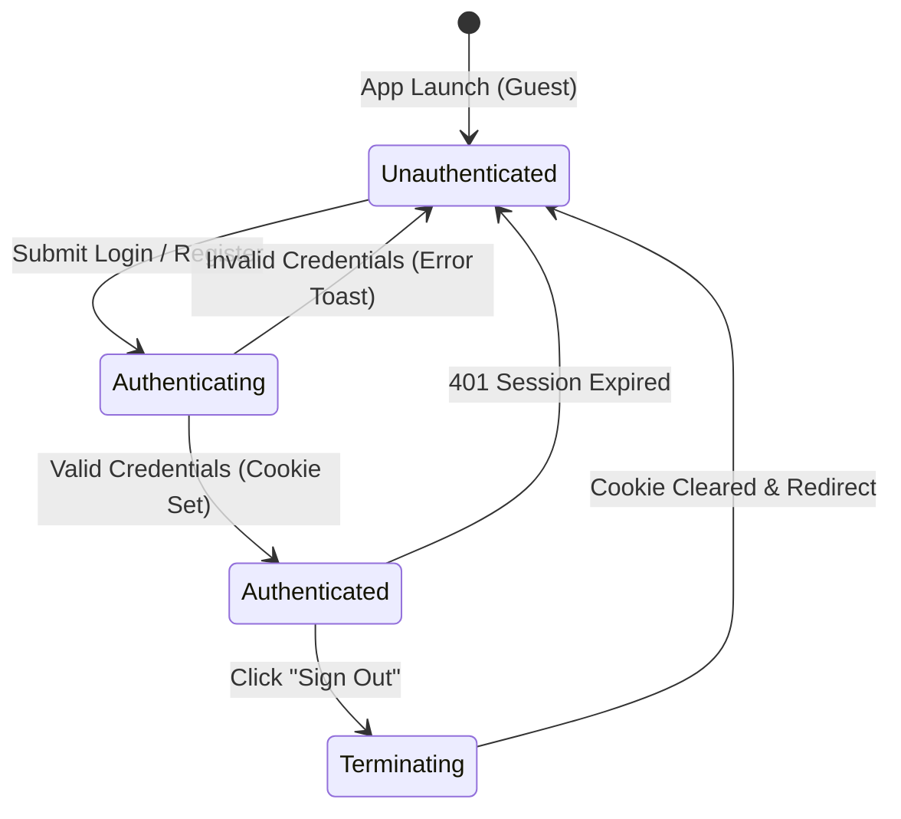
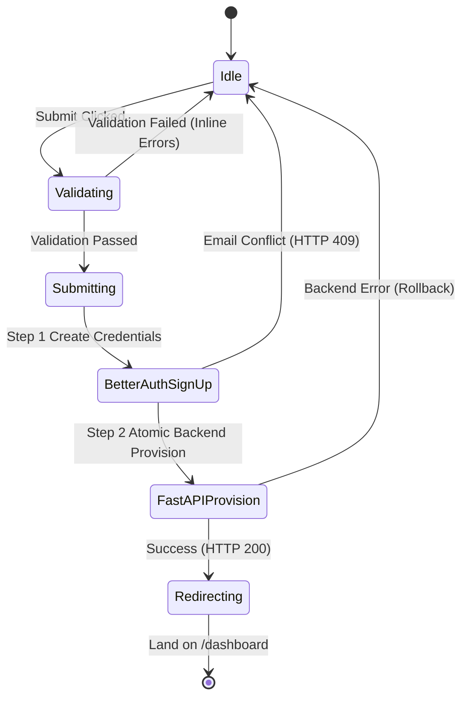

# Data Model & Schema Definitions: Frontend Authentication & Dashboard Shell

**Feature**: `005-frontend-auth-dashboard`  
**Date**: 2026-09-05  
**Spec**: [spec.md](./spec.md)

---

## 1. Client-Side Form Validation Schemas (Zod)

### Registration Schema (`registerSchema`)
```typescript
import { z } from "zod";

export const registerSchema = z.object({
  fullName: z
    .string()
    .min(1, "Full name is required")
    .max(100, "Full name must be under 100 characters"),
  email: z
    .string()
    .min(1, "Email is required")
    .email("Invalid email address"),
  password: z
    .string()
    .min(8, "Password must be at least 8 characters")
    .max(128, "Password must be under 128 characters"),
  businessName: z
    .string()
    .min(1, "Business or organization name is required")
    .max(100, "Business name must be under 100 characters"),
  websiteUrl: z
    .string()
    .url("Must be a valid URL (e.g. https://example.com)")
    .optional()
    .or(z.literal("")),
});

export type RegisterFormValues = z.infer<typeof registerSchema>;
```

### Login Schema (`loginSchema`)
```typescript
export const loginSchema = z.object({
  email: z
    .string()
    .min(1, "Email is required")
    .email("Invalid email address"),
  password: z
    .string()
    .min(1, "Password is required"),
});

export type LoginFormValues = z.infer<typeof loginSchema>;
```

---

## 2. Domain & Context Types

### Owner Profile (`OwnerProfile`)
Represents the authenticated business owner resolved from `GET /api/v1/me`.
```typescript
export interface OwnerProfile {
  id: string; // UUID
  email: string;
  fullName: string;
  status: "active" | "suspended" | "pending";
  organizationId: string; // UUID
  organizationName: string;
  createdAt: string; // ISO 8601
}
```

### Organization Workspace (`OrganizationWorkspace`)
Represents the tenant container resolved from `GET /api/v1/organization/profile`.
```typescript
export interface OrganizationWorkspace {
  id: string; // UUID
  displayName: string;
  createdAt: string; // ISO 8601
  widgetKey?: string;
}
```

### Navigation Item (`NavItem`)
Defines the navigation structure for the dashboard sidebar and mobile drawer.
```typescript
export interface NavItem {
  title: string;
  href: string;
  icon: string; // Lucide icon identifier
  badge?: string;
  disabled?: boolean;
}
```

---

## 3. State Transitions

### Authentication State Machine


### Registration Submission State Machine

