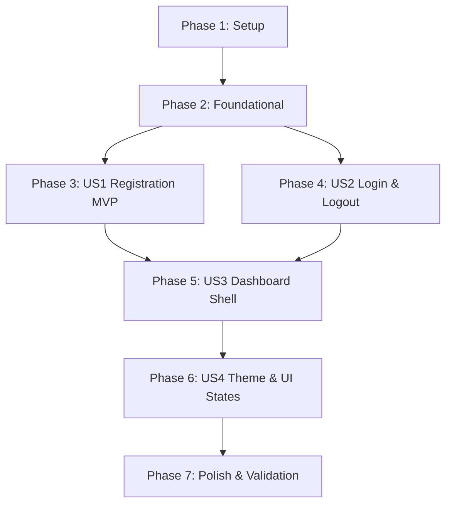

# Tasks: Frontend Authentication, Onboarding & Dashboard Shell

**Feature**: `005-frontend-auth-dashboard`  
**Input**: Feature specification from `specs/005-frontend-auth-dashboard/spec.md`, implementation plan from `plan.md`, data model from `data-model.md`, and contracts from `contracts/auth_and_dashboard_contracts.md`.  
**Target Branch**: `005-frontend-auth-dashboard`

---

## Phase 1: Setup (Shared Infrastructure)

**Purpose**: Project initialization, theme foundation, and base application shell configuration.

- [ ] T001 Initialize environment configuration and verify API endpoint variables in `frontend/.env.local`
- [ ] T002 [P] Configure root font definitions, semantic color variables, and dark theme tokens per Principle VII in `frontend/app/globals.css`
- [ ] T003 [P] Implement client-side `ThemeProvider` wrapper using `next-themes` in `frontend/components/theme-provider.tsx`
- [ ] T004 Integrate `ThemeProvider` and Sonner `Toaster` with root HTML structure in `frontend/app/layout.tsx`

---

## Phase 2: Foundational (Blocking Prerequisites)

**Purpose**: Core validation schemas, TypeScript interfaces, auth client hooks, and server-side route protection.

> **CRITICAL**: No user story work can begin until this foundational phase is complete.

- [ ] T005 [P] Implement client-side Zod validation schemas (`registerSchema`, `loginSchema`) and inferred types in `frontend/lib/validations/auth.ts`
- [ ] T006 [P] Create domain and navigation TypeScript interfaces (`OwnerProfile`, `OrganizationWorkspace`, `NavItem`) in `frontend/types/dashboard.ts`
- [ ] T007 [P] Configure Better Auth client SDK hooks (`createAuthClient`, `useSession`, `signOut`) in `frontend/lib/auth-client.ts`
- [ ] T008 Implement server-to-server native fetch helper injecting FastAPI JWT Bearer token in `frontend/lib/backend-api.ts`
- [ ] T009 Implement edge route protection middleware redirecting unauthenticated guests and authenticated owners in `frontend/middleware.ts`

**Checkpoint**: Foundation ready — user story implementation can now begin.

---

## Phase 3: User Story 1 - Self-Service Business Owner Registration & Workspace Provisioning (Priority: P1) 🎯 MVP

**Goal**: Enable a new business owner to sign up at `/register` with full name, email, password (min 8 chars), business name, and optional website URL. System creates credentials via Better Auth, retrieves an RS256 JWT, calls FastAPI `POST /api/v1/registration/complete` server-to-server to provision the workspace atomically, sets session cookies, and immediately transitions the owner to `/dashboard`.

**Independent Test**: Navigate to `/register`, submit the form with valid unique credentials and a business name, and verify immediate redirect to `/dashboard` displaying the business name in the workspace header.

- [ ] T010 [US1] Implement `registerOwnerAction` Server Action in `frontend/actions/auth-actions.ts` orchestrating Better Auth sign-up, JWT token retrieval, and FastAPI `POST /api/v1/registration/complete`
- [ ] T011 [P] [US1] Create registration form component with React Hook Form, Zod resolver, inline validation errors, and submit loading state in `frontend/components/auth/register-form.tsx`
- [ ] T012 [P] [US1] Create public auth layout container with centered glassmorphic card and semantic styling in `frontend/app/(auth)/layout.tsx`
- [ ] T013 [US1] Create registration page rendering `RegisterForm` with navigation link to sign-in in `frontend/app/(auth)/register/page.tsx`
- [ ] T014 [US1] Create root landing page with direct "Get Started" and "Sign In" CTAs in `frontend/app/page.tsx`

**Checkpoint**: At this point, User Story 1 (MVP) is fully functional and testable end-to-end.

---

## Phase 4: User Story 2 - Secure Owner Authentication, Session Persistence & Logout (Priority: P1)

**Goal**: Enable an existing business owner to log in with their email and password at `/login`. Server Action verifies credentials, establishes an httpOnly session cookie, and redirects to `/dashboard`. If credentials fail, display a generic "Invalid email or password" error. Provide a secure sign-out trigger from the dashboard that clears session cookies and redirects to `/login`.

**Independent Test**: Navigate to `/login`, submit invalid credentials to verify generic error notification, submit valid credentials to verify redirect to `/dashboard`, then trigger "Sign Out" from the profile menu and verify session termination.

- [ ] T015 [US2] Implement `loginOwnerAction` and `signOutOwnerAction` Server Actions with path revalidation in `frontend/actions/auth-actions.ts`
- [ ] T016 [P] [US2] Create login form component with React Hook Form, Zod resolver, generic credential error handling, and password visibility toggle in `frontend/components/auth/login-form.tsx`
- [ ] T017 [US2] Create login page rendering `LoginForm` with navigation link to registration in `frontend/app/(auth)/login/page.tsx`
- [ ] T018 [P] [US2] Create owner user menu dropdown with avatar, email display, and sign-out trigger calling `signOutOwnerAction` in `frontend/components/dashboard/user-menu.tsx`

**Checkpoint**: User Stories 1 and 2 are fully functional and independently testable.

---

## Phase 5: User Story 3 - Protected Dashboard Shell & Primary Navigation (Priority: P1)

**Goal**: Deliver a responsive application shell for authenticated owners with collapsible sidebar navigation, organization switcher/badge showing their business name, top application header with breadcrumbs and user menu, and placeholder module pages.

**Independent Test**: Attempt unauthenticated navigation to `/dashboard` (verify redirect to `/login?callbackUrl=/dashboard`). Log in and verify sidebar renders business name, active route highlights, breadcrumb, and navigation to `/dashboard/documents`, `/dashboard/conversations`, and `/dashboard/widget`.

- [ ] T019 [US3] Implement `getOwnerContextAction` Server Action calling FastAPI `GET /api/v1/me` in `frontend/actions/auth-actions.ts`
- [ ] T020 [P] [US3] Create collapsible desktop and mobile responsive sidebar component with semantic tokens in `frontend/components/dashboard/sidebar.tsx`
- [ ] T021 [P] [US3] Create top dashboard application header with breadcrumbs, mobile trigger, theme toggle, and user menu in `frontend/components/dashboard/header.tsx`
- [ ] T022 [US3] Implement protected dashboard layout resolving owner profile and wrapping children in `frontend/app/dashboard/layout.tsx`
- [ ] T023 [P] [US3] Implement dashboard overview metrics and quickstart welcome view in `frontend/app/dashboard/page.tsx`
- [ ] T024 [P] [US3] Create knowledge base documents placeholder route in `frontend/app/dashboard/documents/page.tsx`
- [ ] T025 [P] [US3] Create conversations inbox placeholder route in `frontend/app/dashboard/conversations/page.tsx`
- [ ] T026 [P] [US3] Create widget customizer placeholder route in `frontend/app/dashboard/widget/page.tsx`

**Checkpoint**: All three P1 User Stories are complete and form an integrated user experience.

---

## Phase 6: User Story 4 - Seamless API Gateway, Theme Toggle & UI States (Priority: P2)

**Goal**: Provide light/dark mode switching using semantic CSS variables without color conflicts or flashing. Display dedicated loading skeletons while resolving workspace data, and provide resilient error boundaries with retry triggers when backend services are temporarily unavailable.

**Independent Test**: Toggle between light, dark, and system modes; verify root `html` class changes and colors adapt using semantic CSS variables without contrast issues. Simulate network failure; verify error boundary renders retry trigger.

- [ ] T027 [P] [US4] Create theme toggle button component with light, dark, and system dropdown options in `frontend/components/theme-toggle.tsx`
- [ ] T028 [P] [US4] Create root dashboard loading skeleton with placeholder cards and sidebar skeleton in `frontend/app/dashboard/loading.tsx`
- [ ] T029 [US4] Create root dashboard error boundary with error recovery button in `frontend/app/dashboard/error.tsx`
- [ ] T030 [US4] Audit all created components for strict compliance with Constitution Principle VII (semantic tokens only, zero hard-coded palette classes) in `frontend/app/globals.css` and `frontend/components/`

**Checkpoint**: Theme toggling, loading skeletons, and error boundaries function gracefully across all viewports.

---

## Phase 7: Polish & Cross-Cutting Concerns

**Purpose**: Production readiness, build verification, and end-to-end documentation alignment.

- [ ] T031 [P] Verify and update end-to-end testing instructions and scenario steps in `specs/005-frontend-auth-dashboard/quickstart.md`
- [ ] T032 Execute full production build (`npm run build`) in `frontend/` to verify zero compile or TypeScript errors
- [ ] T033 Validate end-to-end registration, login, route protection, and logout flows per quickstart scenarios

---

## Dependencies & Execution Order

### Phase Dependencies

- **Setup (Phase 1)**: No dependencies — can start immediately.
- **Foundational (Phase 2)**: Depends on Phase 1 completion — BLOCKS all user stories.
- **User Story 1 (Phase 3 - MVP)**: Depends on Phase 2. Delivers registration and initial workspace onboarding.
- **User Story 2 (Phase 4)**: Depends on Phase 2 and User Story 1 (uses shared Server Actions structure).
- **User Story 3 (Phase 5)**: Depends on Phase 2, User Story 1, and User Story 2 (requires authenticated session context).
- **User Story 4 (Phase 6)**: Enhances User Story 3 layout with theme toggle, loading skeleton, and error boundary.
- **Polish (Phase 7)**: Depends on all user story phases being complete.

### User Story Dependencies

---

## Parallel Opportunities

- **Phase 1 (Setup)**: Tasks T002 (`globals.css`) and T003 (`theme-provider.tsx`) can run in parallel.
- **Phase 2 (Foundational)**: Tasks T005 (Zod schemas), T006 (TypeScript types), and T007 (Better Auth client) can run in parallel.
- **Phase 3 (User Story 1)**: Tasks T011 (`register-form.tsx`) and T012 (`auth/layout.tsx`) can run in parallel.
- **Phase 4 (User Story 2)**: Tasks T016 (`login-form.tsx`) and T018 (`user-menu.tsx`) can run in parallel.
- **Phase 5 (User Story 3)**: Tasks T020 (`sidebar.tsx`), T021 (`header.tsx`), T023 (`dashboard/page.tsx`), T024 (`documents/page.tsx`), T025 (`conversations/page.tsx`), and T026 (`widget/page.tsx`) can run in parallel once layout dependencies are mapped.
- **Phase 6 (User Story 4)**: Tasks T027 (`theme-toggle.tsx`) and T028 (`loading.tsx`) can run in parallel.

---

## Implementation Strategy

### MVP First (User Story 1 Only)
1. Complete **Phase 1: Setup** (theme tokens, provider).
2. Complete **Phase 2: Foundational** (Zod schemas, types, Better Auth client, native fetch helper, middleware).
3. Complete **Phase 3: User Story 1** (`registerOwnerAction`, `RegisterForm`, `/register` page, `/` landing page).
4. **STOP and VALIDATE**: Test User Story 1 independently by registering a new account and verifying workspace creation in FastAPI.

### Incremental Delivery
1. Add **User Story 2**: Implement login Server Action, `LoginForm`, `/login` page, and sign-out trigger.
2. Add **User Story 3**: Construct dashboard layout, responsive sidebar, app header, and overview page.
3. Add **User Story 4**: Polish theme toggle, loading skeletons, and error boundaries.
4. Run production build verification (`npm run build`).
