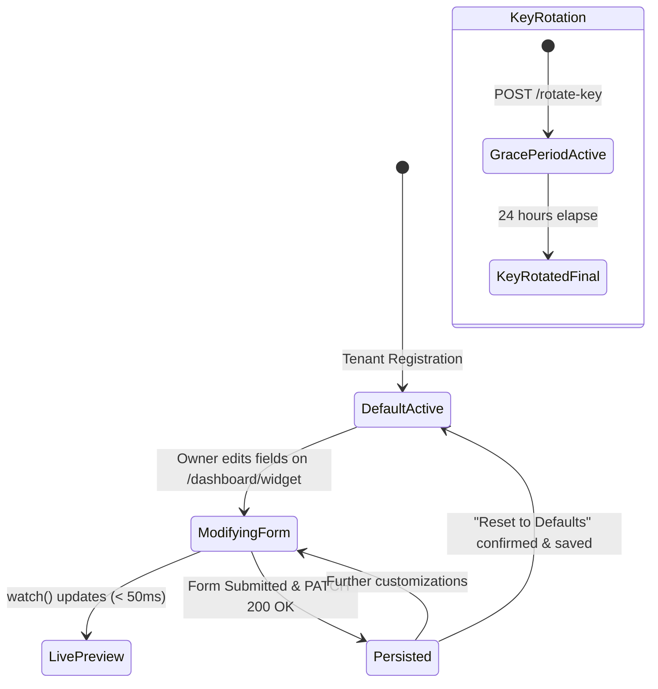

# Data Model: Feature 007 (Widget Customizer UI)

**Feature**: `007-widget-customizer-ui`  
**Date**: 2026-09-05  
**Spec**: [spec.md](./spec.md)

---

## 1. Relational Entities (PostgreSQL / SQLModel)

### `WidgetConfiguration` (Existing Table: `widget_configurations`)

Represents the persistent widget settings associated 1-to-1 with an `Organization`.

| Column | Type | Constraints | Description |
|---|---|---|---|
| `id` | `UUID` | Primary Key, default `uuid4` | Unique widget configuration identifier. |
| `organization_id` | `UUID` | Foreign Key (`organizations.id`), Unique, Indexed | Strict tenant ownership boundary. |
| `widget_key` | `VARCHAR(64)` | Unique, Indexed, Non-null | Active public widget key (`rd_live_*`). |
| `previous_widget_key` | `VARCHAR(64)` | Nullable, Indexed | Previous key during 24h rotation grace period. |
| `grace_expires_at` | `TIMESTAMPTZ` | Nullable | Expiration timestamp for the grace key. |
| `primary_color` | `VARCHAR(9)` | Default `#4F46E5`, Non-null | 6-character hex color code (e.g., `#4F46E5`). |
| `bot_display_name` | `VARCHAR(100)` | Default `"Support Assistant"`, Non-null | Assistant title displayed in chat header. |
| `welcome_message` | `VARCHAR(500)` | Default `"Hi! How can I help you today?"`, Non-null | Initial greeting bubble displayed on open. |
| `widget_placement` | `VARCHAR(20)` | Default `"bottom-right"`, Non-null | Placement (`bottom-right` or `bottom-left`). |
| `allowed_origins` | `VARCHAR(500)` | Default `"*"`, Non-null | Comma-separated allowed hostnames or `*`. |
| `created_at` | `TIMESTAMPTZ` | Non-null, default UTC now | Timestamp of initial provisioning. |
| `updated_at` | `TIMESTAMPTZ` | Non-null, default UTC now | Timestamp of last modification. |

---

## 2. Pydantic Schemas & DTOs (Backend)

### `WidgetUpdateRequest` (`app/schemas/organization.py`)
Schema for `PATCH /api/v1/organization/widget`.

```python
class WidgetUpdateRequest(BaseModel):
    bot_display_name: Optional[str] = Field(None, min_length=1, max_length=100)
    welcome_message: Optional[str] = Field(None, min_length=1, max_length=500)
    primary_color: Optional[str] = Field(None, pattern=r"^#([A-Fa-f0-9]{6})$")
    widget_placement: Optional[Literal["bottom-right", "bottom-left"]] = None
    allowed_origins: Optional[str] = Field(None, max_length=500)
```

### `WidgetKeyRotationResponse` (Existing)
```python
class WidgetKeyRotationResponse(BaseModel):
    new_widget_key: str
    previous_widget_key: str
    grace_expires_at: datetime.datetime
    embed_snippet: str
```

### `OrganizationProfileResponse` (Existing)
Returned by `GET /api/v1/organization/profile` to populate initial dashboard state.

---

## 3. TypeScript Interfaces & Validation Schemas (Frontend)

### `frontend/types/widget.ts`
```typescript
export type WidgetPlacement = "bottom-right" | "bottom-left";

export interface WidgetConfig {
  widget_key: string;
  previous_widget_key?: string | null;
  grace_expires_at?: string | null;
  has_grace_key: boolean;
  bot_display_name: string;
  welcome_message: string;
  primary_color: string;
  widget_placement: WidgetPlacement;
  allowed_origins: string;
  embed_snippet: string;
}

export interface WidgetUpdatePayload {
  bot_display_name?: string;
  welcome_message?: string;
  primary_color?: string;
  widget_placement?: WidgetPlacement;
  allowed_origins?: string;
}
```

### `frontend/lib/validations/widget.ts`
Zod schema for the form:
```typescript
import { z } from "zod";

export const widgetFormSchema = z.object({
  bot_display_name: z
    .string()
    .trim()
    .min(1, "Bot display name cannot be empty")
    .max(100, "Bot display name cannot exceed 100 characters"),
  welcome_message: z
    .string()
    .trim()
    .min(1, "Welcome greeting cannot be empty")
    .max(500, "Welcome greeting cannot exceed 500 characters"),
  primary_color: z
    .string()
    .trim()
    .regex(/^#([A-Fa-f0-9]{6})$/, "Must be a valid 6-character hex color (e.g. #4F46E5)"),
  widget_placement: z.enum(["bottom-right", "bottom-left"]),
  domain_scope: z.enum(["all", "restricted"]),
  restricted_domains: z.string().optional(),
});

export type WidgetFormValues = z.infer<typeof widgetFormSchema>;
```

---

## 4. State Transitions & Lifecycle


