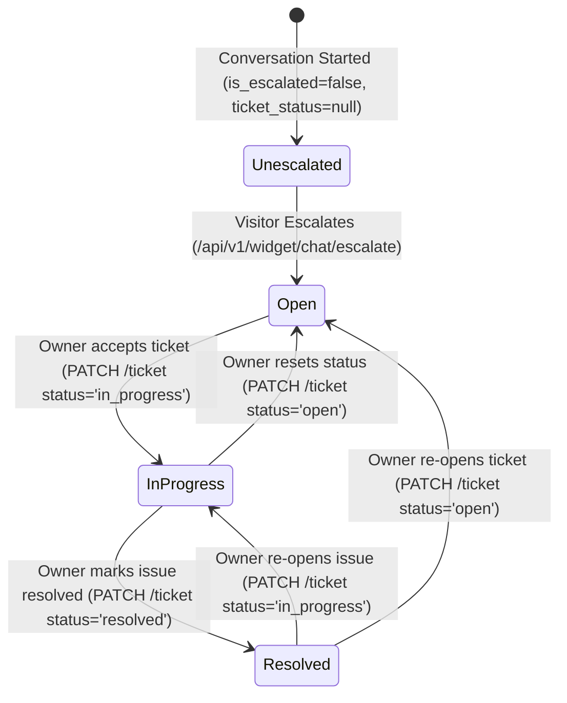

# Data Model: Conversations Inbox & Ticket Management UI

**Feature Branch**: `009-conversations-inbox-ui`  
**Date**: 2026-09-06  
**Status**: Complete

---

## 1. Relational Database Entities (SQLModel / PostgreSQL)

### 1.1 `Conversation` Entity
Represents an ongoing or completed chat session between an anonymous website visitor and the AI assistant, optionally escalated to a human support ticket.

- **Table**: `conversations`
- **Multi-Tenant Isolation**: Scoped strictly by `organization_id`.

| Field Name | Type | Constraints | Description |
|---|---|---|---|
| `id` | `UUID` | Primary Key, Indexed, Default: `uuid.uuid4()` | Unique conversation identifier |
| `organization_id` | `UUID` | Foreign Key (`organizations.id`), Indexed, Not Null | Multi-tenant organization ownership |
| `is_escalated` | `Boolean` | Not Null, Default: `False`, Indexed | Whether visitor requested human support |
| `ticket_status` | `String(20)` | Nullable, Indexed, Values: `'open'`, `'in_progress'`, `'resolved'` | Resolution status of escalated ticket (null if not escalated) |
| `visitor_email` | `String(255)` | Nullable | Contact email submitted by visitor during escalation |
| `created_at` | `DateTime(tz=True)` | Not Null, Default: `utc_now()` | Timestamp of conversation creation |
| `updated_at` | `DateTime(tz=True)` | Not Null, Default: `utc_now()`, Indexed | Timestamp of last message or status transition |

**State Transitions for `ticket_status`**:


---

### 1.2 `Message` Entity
Represents an individual conversational turn in a conversation.

- **Table**: `messages`
- **Foreign Key**: Scoped to parent conversation (`conversations.id`).

| Field Name | Type | Constraints | Description |
|---|---|---|---|
| `id` | `UUID` | Primary Key, Indexed, Default: `uuid.uuid4()` | Unique message identifier |
| `conversation_id` | `UUID` | Foreign Key (`conversations.id`), Indexed, Not Null | Parent conversation session |
| `role` | `String(20)` | Not Null, Values: `'visitor'`, `'assistant'`, `'system'` | Origin role of the turn |
| `content` | `Text` | Not Null | Complete message text payload |
| `citations` | `JSON` | Nullable, Default: `None` | Array of source document references used by assistant |
| `created_at` | `DateTime(tz=True)` | Not Null, Default: `utc_now()`, Indexed | Message creation timestamp |

**Compound Index**:
- `ix_messages_conv_created`: `(conversation_id, created_at ASC)` for high-performance chronological transcript queries.

---

## 2. API Data Transfer Objects (Pydantic Schemas)

### 2.1 Conversation Summary & List Response
Used by the master sidebar list and search filtering.

```python
class CitationItem(BaseModel):
    document_id: str
    title: str

class ChatMessageRead(BaseModel):
    id: uuid.UUID
    role: str
    content: str
    created_at: datetime
    citations: Optional[List[CitationItem]] = None

class ConversationListItem(BaseModel):
    id: uuid.UUID
    created_at: datetime
    updated_at: datetime
    is_escalated: bool = False
    ticket_status: Optional[str] = None
    visitor_email: Optional[str] = None
    message_count: int = 0
    last_message_preview: Optional[str] = None
    last_message_role: Optional[str] = None

    model_config = ConfigDict(from_attributes=True)

class ConversationListResponse(BaseModel):
    total: int
    limit: int
    offset: int
    items: List[ConversationListItem]
```

### 2.2 Conversation Transcript Detail Response
Used by the detail transcript pane.

```python
class ConversationDetailResponse(BaseModel):
    id: uuid.UUID
    organization_id: uuid.UUID
    created_at: datetime
    updated_at: datetime
    is_escalated: bool
    ticket_status: Optional[str] = None
    visitor_email: Optional[str] = None
    messages: List[ChatMessageRead]

    model_config = ConfigDict(from_attributes=True)
```

### 2.3 Ticket Status Mutation Request & Response
Used when owner changes ticket status in the detail banner.

```python
class TicketStatusUpdateRequest(BaseModel):
    status: Literal["open", "in_progress", "resolved"] = Field(
        ...,
        description="Target ticket lifecycle status",
    )

class TicketStatusUpdateResponse(BaseModel):
    id: uuid.UUID
    ticket_status: str
    updated_at: datetime
```

### 2.4 Conversation Stats Overview Response
Used by top overview summary metric cards.

```python
class ConversationStatsResponse(BaseModel):
    total_conversations: int
    total_messages: int
    escalated_conversations: int
    active_last_24h: int
```

---

## 3. Frontend TypeScript Interfaces & Client State

### 3.1 Domain Types (`frontend/types/conversation.ts`)

```typescript
export type TicketStatus = "open" | "in_progress" | "resolved";

export interface CitationItem {
  document_id: string;
  title: string;
}

export interface ChatMessage {
  id: string;
  role: "visitor" | "assistant" | "system";
  content: string;
  created_at: string;
  citations?: CitationItem[] | null;
}

export interface ConversationSummary {
  id: string;
  created_at: string;
  updated_at: string;
  is_escalated: boolean;
  ticket_status?: TicketStatus | null;
  visitor_email?: string | null;
  message_count: number;
  last_message_preview?: string | null;
  last_message_role?: string | null;
  is_new?: boolean; // Client-side flag for background polled additions
}

export interface ConversationDetail {
  id: string;
  organization_id: string;
  created_at: string;
  updated_at: string;
  is_escalated: boolean;
  ticket_status?: TicketStatus | null;
  visitor_email?: string | null;
  messages: ChatMessage[];
}

export interface ConversationStats {
  total_conversations: number;
  total_messages: number;
  escalated_conversations: number;
  active_last_24h: number;
}
```

### 3.2 UI Filter & View State

```typescript
export type InboxFilterTab = "all" | "escalated";

export interface InboxViewState {
  selectedConversationId: string | null;
  activeFilter: InboxFilterTab;
  searchQuery: string;
  page: number;
  pageSize: number;
  isMobileDetailOpen: boolean;
}
```
