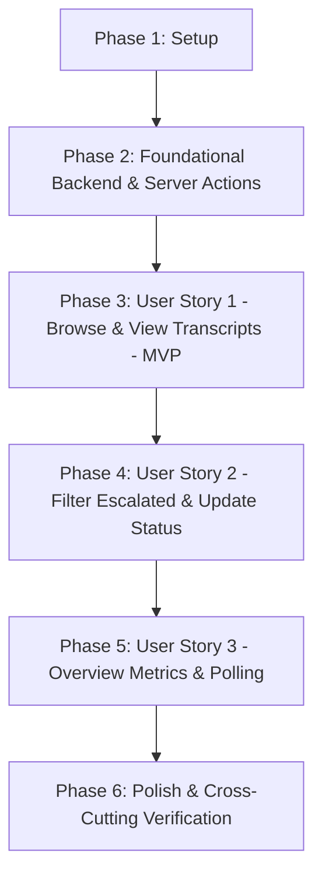

# Tasks: Conversations Inbox & Ticket Management UI

**Feature Branch**: `009-conversations-inbox-ui`  
**Date**: 2026-09-06  
**Status**: Ready for Implementation  
**Specification**: [Feature Spec](file:///d:/AbdullahQureshi/workspace/resolvdesk/specs/009-conversations-inbox-ui/spec.md) | [Implementation Plan](file:///d:/AbdullahQureshi/workspace/resolvdesk/specs/009-conversations-inbox-ui/plan.md)

---

## Phase 1: Setup (Shared Infrastructure)

**Purpose**: Initialize frontend domain type definitions and foundational structures.

- [x] T001 [P] Create TypeScript domain interfaces and UI state types in frontend/types/conversation.ts

---

## Phase 2: Foundational (Blocking Prerequisites)

**Purpose**: Core backend schema migrations, database repository updates, service logic, API endpoints, and frontend Server Actions that MUST be complete before user stories can be implemented.

**⚠️ CRITICAL**: No user story work can begin until this foundational phase is complete.

- [x] T002 Create Alembic database migration 005_add_ticket_fields_to_conversations.py in backend/alembic/versions/005_add_ticket_fields_to_conversations.py
- [x] T003 [P] Update SQLModel models with ticket_status, visitor_email, and citations in backend/app/models/conversation.py
- [x] T004 [P] Update Pydantic DTO schemas for conversation list, transcript, and ticket status in backend/app/schemas/conversation.py and backend/app/schemas/chat.py
- [x] T005 Update ConversationRepository to query and update ticket fields and citations in backend/app/repos/conversation_repo.py
- [x] T006 Update ChatService to set ticket_status and visitor_email on escalation and store citations in backend/app/services/chat_service.py
- [x] T007 Implement ticket status transition logic and validation in backend/app/services/owner_conversation_service.py
- [x] T008 Add PATCH /api/v1/conversations/{conversation_id}/ticket endpoint in backend/app/routers/conversations.py
- [x] T009 [P] Add contract tests for PATCH /ticket endpoint and updated schemas in backend/tests/contract/test_owner_conversations_contract.py
- [x] T010 [P] Add integration tests verifying multi-tenant isolation on ticket updates in backend/tests/integration/test_owner_conversations_isolation.py
- [x] T011 Implement Server Actions for conversation listing, transcript, stats, and ticket updates in frontend/actions/conversation-actions.ts

**Checkpoint**: Backend database schema migrated, PATCH endpoint implemented and verified via automated tests, and frontend Server Actions ready.

---

## Phase 3: User Story 1 - Browse Conversations and View Transcripts (Priority: P1) 🎯 MVP

**Goal**: Enable business owners to view an organized split-pane list of customer conversations, select any chat to inspect the full chronological transcript with citation badges, and gracefully handle empty and loading states.

**Independent Test**: Log in as an organization owner, open `/dashboard/conversations`, verify the first conversation is auto-selected on desktop with its full transcript loaded, click through different conversation items observing instantaneous detail updates and URL sync (`?id=...`), and verify the empty state when no chats exist.

- [x] T012 [P] [US1] Create loading skeletons for master-detail split-view in frontend/components/conversations/conversations-skeleton.tsx
- [x] T013 [P] [US1] Create route-level loading boundary in frontend/app/dashboard/conversations/loading.tsx
- [x] T014 [P] [US1] Create route-level error boundary with retry UI in frontend/app/dashboard/conversations/error.tsx
- [x] T015 [US1] Implement chronological transcript viewer with citation badges in frontend/components/conversations/conversation-transcript.tsx
- [x] T016 [US1] Implement scrollable master conversation list with previews and pagination in frontend/components/conversations/conversation-list.tsx
- [x] T017 [US1] Implement master-detail split-pane coordinator with URL search param sync and mobile view toggle in frontend/components/conversations/conversations-inbox.tsx
- [x] T018 [US1] Update conversations dashboard page server component with initial data hydration in frontend/app/dashboard/conversations/page.tsx

**Checkpoint**: User Story 1 is fully functional and testable independently. Owners can browse conversations, inspect full transcripts with citations, and navigate seamlessly.

---

## Phase 4: User Story 2 - Filter Escalated Support Tickets and Update Status (Priority: P2)

**Goal**: Allow business owners to filter for escalated customer chats, view customer contact email tooling (one-click copy and `mailto:` link), and transition ticket status (`open` → `in_progress` → `resolved`) with optimistic feedback.

**Independent Test**: Click the "Escalated Only" filter tab, verify only escalated conversations appear, select an escalated ticket, verify customer email copy and `mailto:` actions, and change ticket status to "In Progress" and "Resolved", confirming optimistic UI updates and backend persistence.

- [x] T019 [P] [US2] Implement EscalationCard with email copy feedback, mailto launcher, and status dropdown selector in frontend/components/conversations/escalation-card.tsx
- [x] T020 [US2] Integrate EscalationCard into detail transcript view in frontend/components/conversations/conversation-transcript.tsx
- [x] T021 [US2] Add Escalated filter tab toggle and status pill badges in frontend/components/conversations/conversation-list.tsx
- [x] T022 [US2] Implement optimistic ticket status transitions and server action mutation handling in frontend/components/conversations/conversations-inbox.tsx

**Checkpoint**: User Stories 1 and 2 work cohesively. Owners can triage and resolve escalated tickets with full customer follow-up tooling.

---

## Phase 5: User Story 3 - Real-Time Support Volume Metrics & Refresh (Priority: P3)

**Goal**: Display aggregate support health metrics cards, provide keyword search filtering across conversations, and enable non-disruptive background polling (every 30 seconds) that silently prepends newly arrived chats.

**Independent Test**: Verify the 4 overview metric cards display accurate aggregates, type in search box to filter conversation previews, trigger incoming message via widget and observe silent prepend with "New" badge during 30s background poll without interrupting active transcript scroll.

- [x] T023 [P] [US3] Implement conversation overview statistics metric cards in frontend/components/conversations/conversation-stats-cards.tsx
- [x] T024 [US3] Add client-side keyword search bar for filtering conversation preview snippets in frontend/components/conversations/conversation-list.tsx
- [x] T025 [US3] Implement 30-second visibility-aware background polling and non-disruptive prepend logic in frontend/components/conversations/conversations-inbox.tsx
- [x] T026 [US3] Add manual Refresh button with spinning animation in frontend/components/conversations/conversation-list.tsx

**Checkpoint**: All three user stories are complete. The inbox provides real-time monitoring, live stats, search, and silent incoming chat updates.

---

## Phase 6: Polish & Cross-Cutting Concerns

**Purpose**: Verification, semantic theme compliance, accessibility, and end-to-end regression testing.

- [x] T027 [P] Perform semantic theme token audit across all conversations components to ensure 100% compliance with Constitution Principle VII
- [x] T028 [P] Verify responsive behavior on mobile viewports (< 768px) and accessible keyboard navigation
- [x] T029 Run full backend pytest test suite and frontend type-checking and linting
- [x] T030 Execute end-to-end verification scenarios per quickstart.md in specs/009-conversations-inbox-ui/quickstart.md

---

## Dependencies & Execution Order

### Phase Dependencies

- **Setup (Phase 1)**: No dependencies — can start immediately.
- **Foundational (Phase 2)**: Depends on Setup (T001) — BLOCKS all user stories.
- **User Story 1 (Phase 3 - P1)**: Depends on Phase 2 (T002–T011).
- **User Story 2 (Phase 4 - P2)**: Depends on User Story 1 completion.
- **User Story 3 (Phase 5 - P3)**: Depends on User Story 1 & 2 completion.
- **Polish (Phase 6)**: Depends on all user stories being complete.

### User Story Dependencies

---

## Parallel Opportunities

- **Phase 1 & 2**:
  - `T003` (models), `T004` (schemas), and `T009`/`T010` (tests) can be authored in parallel.
- **Phase 3 (User Story 1)**:
  - `T012` (skeleton), `T013` (loading.tsx), and `T014` (error.tsx) can be built in parallel.
- **Phase 4 (User Story 2)**:
  - `T019` (EscalationCard) can be built in parallel with list badge styling.
- **Phase 5 (User Story 3)**:
  - `T023` (StatsCards) can be built independently from search and polling logic.
- **Phase 6 (Polish)**:
  - `T027` (Theme token audit) and `T028` (Mobile responsiveness audit) can run in parallel.

---

## Implementation Strategy

### MVP First (User Story 1 Only)
1. Complete Phase 1: Setup (`T001`).
2. Complete Phase 2: Foundational (`T002`–`T011`).
3. Complete Phase 3: User Story 1 (`T012`–`T018`).
4. **STOP and VALIDATE**: Verify business owners can log in, view conversation list, inspect full transcripts with citations, and navigate without error.

### Incremental Delivery
1. Foundation complete → Core database columns and Server Actions operational.
2. Deliver US1 → MVP inbox allows reading customer inquiries.
3. Deliver US2 → Escalation management unlocks customer contact and ticket resolution.
4. Deliver US3 → Overview metrics and background polling provide real-time operational oversight.
5. Polish & Verification → Theme token adherence verified and test suites green.
