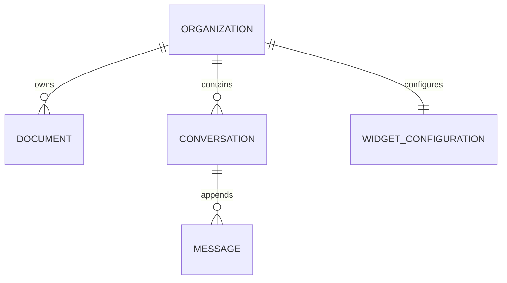

# Data Model: Conversational Intent & Chit-Chat Handling

**Feature**: `014-chat-intent-handling`  
**Date**: 2026-09-10  
**Status**: Completed

## 1. Entity Overview & Relationships



---

## 2. Model Modifications

### `Message` (Relational Store: PostgreSQL)
Extends the existing `messages` table model in `backend/app/models/conversation.py`.

| Field Name | Type | Nullable | Default | Description |
|---|---|---|---|---|
| `id` | `UUID` | No | `uuid4()` | Primary Key |
| `conversation_id` | `UUID` | No | - | Foreign Key -> `conversations.id` (Indexed) |
| `role` | `VARCHAR(20)` | No | - | `visitor`, `assistant`, or `system` |
| `content` | `TEXT` | No | - | Full raw text content of the message |
| `citations` | `JSON` | Yes | `None` | Document source citations if grounded |
| `metadata_json` | `JSON` | Yes | `None` | Structured turn metadata (Mapped to column `"metadata"`) |
| `created_at` | `TIMESTAMPTZ` | No | `utc_now()` | Timestamp of turn creation (Indexed) |

#### Structure of `metadata_json`
```json
{
  "intent": "GREETING",
  "tier": 1,
  "confidence": 1.0,
  "suggest_escalation": false,
  "detected_language": "en"
}
```

---

### `WidgetConfiguration` (Optional Extension)
In `backend/app/models/widget.py`, supports custom greeting overrides per organization:

| Field Name | Type | Nullable | Default | Description |
|---|---|---|---|---|
| `custom_greeting` | `VARCHAR(500)` | Yes | `None` | Optional custom introductory greeting text overriding the default persona |

---

## 3. Intent Classification Taxonomy (Python Enum / Value Set)

Located in `backend/app/schemas/intent.py`:

```python
class MessageIntent(str, Enum):
    GREETING = "GREETING"
    GRATITUDE = "GRATITUDE"
    FAREWELL = "FAREWELL"
    BOT_IDENTITY = "BOT_IDENTITY"
    KNOWLEDGE_INQUIRY = "KNOWLEDGE_INQUIRY"
    HYBRID_INQUIRY = "HYBRID_INQUIRY"
    OUT_OF_SCOPE = "OUT_OF_SCOPE"
    HUMAN_ESCALATION = "HUMAN_ESCALATION"
    FALLBACK = "FALLBACK"
```

---

## 4. Intent Classification Result Schema

```python
class IntentClassificationResult(BaseModel):
    intent: MessageIntent
    tier: int  # 1 (Heuristic) or 2 (Semantic/LLM)
    confidence: float
    is_chitchat: bool
    suggest_escalation: bool
    sample_topics: Optional[List[str]] = None
    response_override: Optional[str] = None
```
